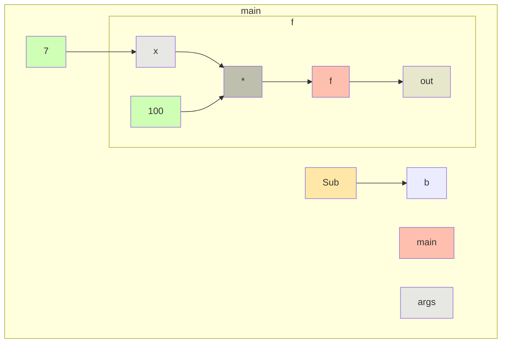

```mermaid
flowchart TD
  subgraph b0["main"]
    n1[main]:::RETURN
    n2[args]:::FUNC_PARAM
    n3[Sub]:::EXTERNAL
    n4[b]:::OBJ_VARIABLE
    n5[7]:::LITERAL
    n11[out]:::VARIABLE
    n3[Sub]:::EXTERNAL --> n4[b]:::OBJ_VARIABLE
    n5[7]:::LITERAL --> n8[x]:::FUNC_PARAM
    subgraph b6["f"]
      n7[f]:::RETURN
      n8[x]:::FUNC_PARAM
      n9[100]:::LITERAL
      n10[*]:::BIN_OP
      n7[f]:::RETURN --> n11[out]:::VARIABLE
      n8[x]:::FUNC_PARAM --> n10[*]:::BIN_OP
      n9[100]:::LITERAL --> n10[*]:::BIN_OP
      n10[*]:::BIN_OP --> n7[f]:::RETURN
    end
  end
  classDef LITERAL fill:#00FF0030
  classDef VARIABLE fill:#80808030
  classDef BIN_OP fill:#80808080
  classDef FUNC_PARAM fill:#8080FF30
  classDef RETURN fill:#FF808080
  classDef EXTERNAL fill:#FFA50040
  classDef UNMODELLED fill:#FF000030,stroke-dasharray: 4 2
```
