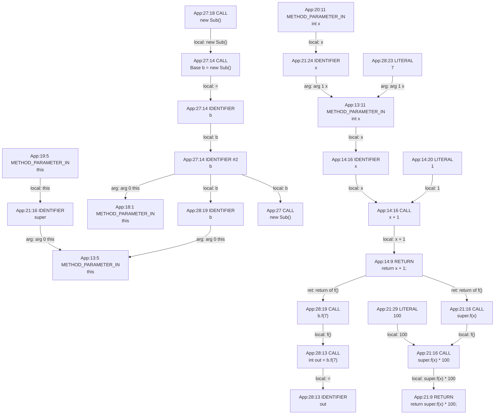

# overriddenSuper: spike value graph

```mermaid
flowchart TD
  n0["App:13:11 METHOD_PARAMETER_IN<br/>int x"]
  n1["App:13:5 METHOD_PARAMETER_IN<br/>this"]
  n2["App:14:16 CALL<br/>x + 1"]
  n3["App:14:16 IDENTIFIER<br/>x"]
  n4["App:14:20 LITERAL<br/>1"]
  n5["App:14:9 RETURN<br/>return x + 1;"]
  n6["App:18:1 METHOD_PARAMETER_IN<br/>this"]
  n7["App:19:5 METHOD_PARAMETER_IN<br/>this"]
  n8["App:20:11 METHOD_PARAMETER_IN<br/>int x"]
  n9["App:21:16 CALL<br/>super.f(x)"]
  n10["App:21:16 CALL<br/>super.f(x) * 100"]
  n11["App:21:16 IDENTIFIER<br/>super"]
  n12["App:21:24 IDENTIFIER<br/>x"]
  n13["App:21:29 LITERAL<br/>100"]
  n14["App:21:9 RETURN<br/>return super.f(x) * 100;"]
  n15["App:27 CALL<br/>new Sub()"]
  n16["App:27:14 CALL<br/>Base b = new Sub()"]
  n17["App:27:14 IDENTIFIER #2<br/>b"]
  n18["App:27:14 IDENTIFIER<br/>b"]
  n19["App:27:18 CALL<br/>new Sub()"]
  n20["App:28:13 CALL<br/>int out = b.f(7)"]
  n21["App:28:13 IDENTIFIER<br/>out"]
  n22["App:28:19 CALL<br/>b.f(7)"]
  n23["App:28:19 IDENTIFIER<br/>b"]
  n24["App:28:23 LITERAL<br/>7"]
  n0 -->|"local: x"| n3
  n10 -->|"local: super.f(x) * 100"| n14
  n11 -->|"arg: arg 0 this"| n1
  n12 -->|"arg: arg 1 x"| n0
  n13 -->|"local: 100"| n10
  n16 -->|"local: ="| n18
  n17 -->|"arg: arg 0 this"| n6
  n17 -->|"local: b"| n15
  n17 -->|"local: b"| n23
  n18 -->|"local: b"| n17
  n19 -->|"local: new Sub()"| n16
  n2 -->|"local: x + 1"| n5
  n20 -->|"local: ="| n21
  n22 -->|"local: f()"| n20
  n23 -->|"arg: arg 0 this"| n1
  n24 -->|"arg: arg 1 x"| n0
  n3 -->|"local: x"| n2
  n4 -->|"local: 1"| n2
  n5 -->|"ret: return of f()"| n22
  n5 -->|"ret: return of f()"| n9
  n7 -->|"local: this"| n11
  n8 -->|"local: x"| n12
  n9 -->|"local: f()"| n10
```
