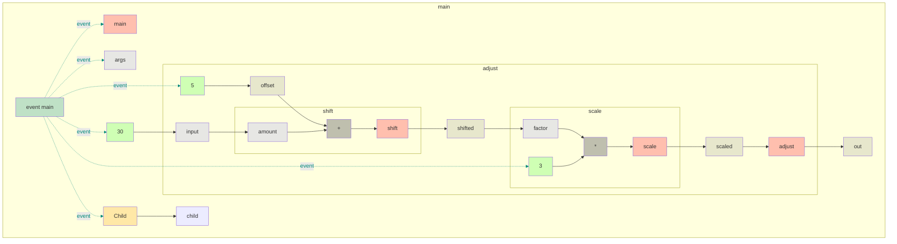

```mermaid
flowchart TD
  subgraph b0["main"]
    n1[event main]:::EVENT
    n2[main]:::RETURN
    n3[args]:::FUNC_PARAM
    n4[Child]:::EXTERNAL
    n5[child]:::OBJ_VARIABLE
    n6[30]:::LITERAL
    n23[out]:::VARIABLE
    n1[event main]:::EVENT -. event .-> n2[main]:::RETURN
    n1[event main]:::EVENT -. event .-> n3[args]:::FUNC_PARAM
    n1[event main]:::EVENT -. event .-> n4[Child]:::EXTERNAL
    n1[event main]:::EVENT -. event .-> n6[30]:::LITERAL
    n1[event main]:::EVENT -. event .-> n10[5]:::LITERAL
    n1[event main]:::EVENT -. event .-> n20[3]:::LITERAL
    n4[Child]:::EXTERNAL --> n5[child]:::OBJ_VARIABLE
    n6[30]:::LITERAL --> n9[input]:::FUNC_PARAM
    n8[adjust]:::RETURN --> n23[out]:::VARIABLE
    subgraph b7["adjust"]
      n8[adjust]:::RETURN
      n9[input]:::FUNC_PARAM
      n10[5]:::LITERAL
      n11[offset]:::VARIABLE
      n16[shifted]:::VARIABLE
      n22[scaled]:::VARIABLE
      n9[input]:::FUNC_PARAM --> n14[amount]:::FUNC_PARAM
      n10[5]:::LITERAL --> n11[offset]:::VARIABLE
      n11[offset]:::VARIABLE --> n15[+]:::BIN_OP
      n16[shifted]:::VARIABLE --> n19[factor]:::FUNC_PARAM
      n22[scaled]:::VARIABLE --> n8[adjust]:::RETURN
      n13[shift]:::RETURN --> n16[shifted]:::VARIABLE
      n18[scale]:::RETURN --> n22[scaled]:::VARIABLE
      subgraph b12["shift"]
        n13[shift]:::RETURN
        n14[amount]:::FUNC_PARAM
        n15[+]:::BIN_OP
        n14[amount]:::FUNC_PARAM --> n15[+]:::BIN_OP
        n15[+]:::BIN_OP --> n13[shift]:::RETURN
      end
      subgraph b17["scale"]
        n18[scale]:::RETURN
        n19[factor]:::FUNC_PARAM
        n20[3]:::LITERAL
        n21[*]:::BIN_OP
        n19[factor]:::FUNC_PARAM --> n21[*]:::BIN_OP
        n20[3]:::LITERAL --> n21[*]:::BIN_OP
        n21[*]:::BIN_OP --> n18[scale]:::RETURN
      end
    end
  end
  linkStyle 0 stroke:#00897b,color:#00897b
  linkStyle 1 stroke:#00897b,color:#00897b
  linkStyle 2 stroke:#00897b,color:#00897b
  linkStyle 3 stroke:#00897b,color:#00897b
  linkStyle 4 stroke:#00897b,color:#00897b
  linkStyle 5 stroke:#00897b,color:#00897b
  classDef LITERAL fill:#00FF0030
  classDef VARIABLE fill:#80808030
  classDef BIN_OP fill:#80808080
  classDef FUNC_PARAM fill:#8080FF30
  classDef RETURN fill:#FF808080
  classDef EXTERNAL fill:#FFA50040
  classDef UNMODELLED fill:#FF000030,stroke-dasharray: 4 2
  classDef EVENT fill:#00897B40
```
