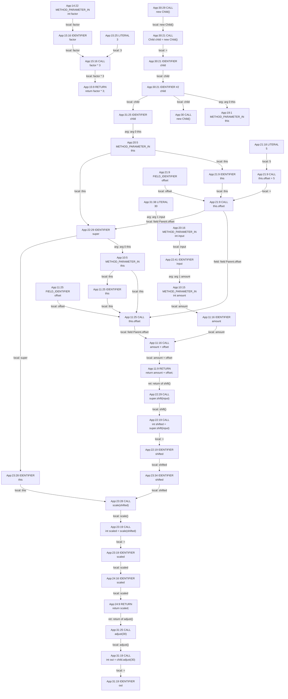

# parentMethod: spike value graph

```mermaid
flowchart TD
  n0["App:10:15 METHOD_PARAMETER_IN<br/>int amount"]
  n1["App:10:5 METHOD_PARAMETER_IN<br/>this"]
  n2["App:11:16 CALL<br/>amount + offset"]
  n3["App:11:16 IDENTIFIER<br/>amount"]
  n4["App:11:25 CALL<br/>this.offset"]
  n5["App:11:25 FIELD_IDENTIFIER<br/>offset"]
  n6["App:11:25 IDENTIFIER<br/>this"]
  n7["App:11:9 RETURN<br/>return amount + offset;"]
  n8["App:14:22 METHOD_PARAMETER_IN<br/>int factor"]
  n9["App:15:16 CALL<br/>factor * 3"]
  n10["App:15:16 IDENTIFIER<br/>factor"]
  n11["App:15:25 LITERAL<br/>3"]
  n12["App:15:9 RETURN<br/>return factor * 3;"]
  n13["App:19:1 METHOD_PARAMETER_IN<br/>this"]
  n14["App:20:16 METHOD_PARAMETER_IN<br/>int input"]
  n15["App:20:5 METHOD_PARAMETER_IN<br/>this"]
  n16["App:21:18 LITERAL<br/>5"]
  n17["App:21:9 CALL<br/>this.offset"]
  n18["App:21:9 CALL<br/>this.offset = 5"]
  n19["App:21:9 FIELD_IDENTIFIER<br/>offset"]
  n20["App:21:9 IDENTIFIER<br/>this"]
  n21["App:22:19 CALL<br/>int shifted = super.shift(input)"]
  n22["App:22:19 IDENTIFIER<br/>shifted"]
  n23["App:22:29 CALL<br/>super.shift(input)"]
  n24["App:22:29 IDENTIFIER<br/>super"]
  n25["App:22:41 IDENTIFIER<br/>input"]
  n26["App:23:19 CALL<br/>int scaled = scale(shifted)"]
  n27["App:23:19 IDENTIFIER<br/>scaled"]
  n28["App:23:28 CALL<br/>scale(shifted)"]
  n29["App:23:28 IDENTIFIER<br/>this"]
  n30["App:23:34 IDENTIFIER<br/>shifted"]
  n31["App:24:16 IDENTIFIER<br/>scaled"]
  n32["App:24:9 RETURN<br/>return scaled;"]
  n33["App:30 CALL<br/>new Child()"]
  n34["App:30:21 CALL<br/>Child child = new Child()"]
  n35["App:30:21 IDENTIFIER #2<br/>child"]
  n36["App:30:21 IDENTIFIER<br/>child"]
  n37["App:30:29 CALL<br/>new Child()"]
  n38["App:31:19 CALL<br/>int out = child.adjust(30)"]
  n39["App:31:19 IDENTIFIER<br/>out"]
  n40["App:31:25 CALL<br/>adjust(30)"]
  n41["App:31:25 IDENTIFIER<br/>child"]
  n42["App:31:38 LITERAL<br/>30"]
  n0 -->|"local: amount"| n3
  n1 -->|"local: this"| n4
  n1 -->|"local: this"| n6
  n10 -->|"local: factor"| n9
  n11 -->|"local: 3"| n9
  n14 -->|"local: input"| n25
  n15 -->|"local: this"| n20
  n15 -->|"local: this"| n24
  n16 -->|"local: 5"| n18
  n17 -->|"field: field Parent.offset"| n4
  n17 -->|"local: field Parent.offset"| n24
  n18 -->|"local: ="| n17
  n19 -->|"local: offset"| n17
  n2 -->|"local: amount + offset"| n7
  n20 -->|"local: this"| n17
  n21 -->|"local: ="| n22
  n22 -->|"local: shifted"| n30
  n23 -->|"local: shift()"| n21
  n24 -->|"arg: arg 0 this"| n1
  n24 -->|"local: super"| n29
  n25 -->|"arg: arg 1 amount"| n0
  n26 -->|"local: ="| n27
  n27 -->|"local: scaled"| n31
  n28 -->|"local: scale()"| n26
  n29 -->|"local: this"| n28
  n3 -->|"local: amount"| n2
  n30 -->|"local: shifted"| n28
  n31 -->|"local: scaled"| n32
  n32 -->|"ret: return of adjust()"| n40
  n34 -->|"local: ="| n36
  n35 -->|"arg: arg 0 this"| n13
  n35 -->|"local: child"| n33
  n35 -->|"local: child"| n41
  n36 -->|"local: child"| n35
  n37 -->|"local: new Child()"| n34
  n38 -->|"local: ="| n39
  n4 -->|"local: field Parent.offset"| n2
  n40 -->|"local: adjust()"| n38
  n41 -->|"arg: arg 0 this"| n15
  n42 -->|"arg: arg 1 input"| n14
  n5 -->|"local: offset"| n4
  n6 -->|"local: this"| n4
  n7 -->|"ret: return of shift()"| n23
  n8 -->|"local: factor"| n10
  n9 -->|"local: factor * 3"| n12
```
