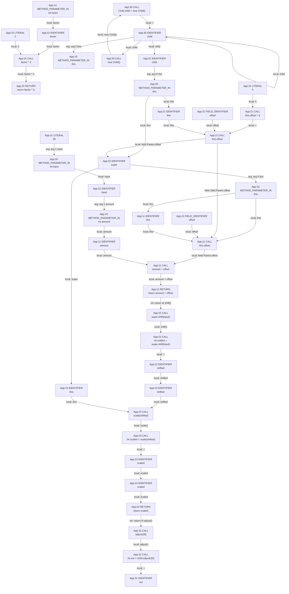

# parentMethod: spike value graph

```mermaid
flowchart TD
  n0["App:10 METHOD_PARAMETER_IN<br/>int amount"]
  n1["App:10 METHOD_PARAMETER_IN<br/>this"]
  n2["App:11 CALL<br/>amount + offset"]
  n3["App:11 CALL<br/>this.offset"]
  n4["App:11 FIELD_IDENTIFIER<br/>offset"]
  n5["App:11 IDENTIFIER<br/>amount"]
  n6["App:11 IDENTIFIER<br/>this"]
  n7["App:11 RETURN<br/>return amount + offset;"]
  n8["App:14 METHOD_PARAMETER_IN<br/>int factor"]
  n9["App:15 CALL<br/>factor * 3"]
  n10["App:15 IDENTIFIER<br/>factor"]
  n11["App:15 LITERAL<br/>3"]
  n12["App:15 RETURN<br/>return factor * 3;"]
  n13["App:19 METHOD_PARAMETER_IN<br/>this"]
  n14["App:20 METHOD_PARAMETER_IN<br/>int input"]
  n15["App:20 METHOD_PARAMETER_IN<br/>this"]
  n16["App:21 CALL<br/>this.offset"]
  n17["App:21 CALL<br/>this.offset = 5"]
  n18["App:21 FIELD_IDENTIFIER<br/>offset"]
  n19["App:21 IDENTIFIER<br/>this"]
  n20["App:21 LITERAL<br/>5"]
  n21["App:22 CALL<br/>int shifted = super.shift(input)"]
  n22["App:22 CALL<br/>super.shift(input)"]
  n23["App:22 IDENTIFIER<br/>input"]
  n24["App:22 IDENTIFIER<br/>shifted"]
  n25["App:22 IDENTIFIER<br/>super"]
  n26["App:23 CALL<br/>int scaled = scale(shifted)"]
  n27["App:23 CALL<br/>scale(shifted)"]
  n28["App:23 IDENTIFIER<br/>scaled"]
  n29["App:23 IDENTIFIER<br/>shifted"]
  n30["App:23 IDENTIFIER<br/>this"]
  n31["App:24 IDENTIFIER<br/>scaled"]
  n32["App:24 RETURN<br/>return scaled;"]
  n33["App:30 CALL<br/>Child child = new Child()"]
  n34["App:30 CALL<br/>new Child()"]
  n35["App:30 IDENTIFIER<br/>child"]
  n36["App:31 CALL<br/>adjust(30)"]
  n37["App:31 CALL<br/>int out = child.adjust(30)"]
  n38["App:31 IDENTIFIER<br/>child"]
  n39["App:31 IDENTIFIER<br/>out"]
  n40["App:31 LITERAL<br/>30"]
  n0 -->|"local: amount"| n5
  n1 -->|"local: this"| n3
  n1 -->|"local: this"| n6
  n10 -->|"local: factor"| n9
  n11 -->|"local: 3"| n9
  n14 -->|"local: input"| n23
  n15 -->|"local: this"| n19
  n15 -->|"local: this"| n25
  n16 -->|"field: field Parent.offset"| n3
  n16 -->|"local: field Parent.offset"| n25
  n17 -->|"local: ="| n16
  n18 -->|"local: offset"| n16
  n19 -->|"local: this"| n16
  n2 -->|"local: amount + offset"| n7
  n20 -->|"local: 5"| n17
  n21 -->|"local: ="| n24
  n22 -->|"local: shift()"| n21
  n23 -->|"arg: arg 1 amount"| n0
  n24 -->|"local: shifted"| n29
  n25 -->|"arg: arg 0 this"| n1
  n25 -->|"local: super"| n30
  n26 -->|"local: ="| n28
  n27 -->|"local: scale()"| n26
  n28 -->|"local: scaled"| n31
  n29 -->|"local: shifted"| n27
  n3 -->|"local: field Parent.offset"| n2
  n30 -->|"local: this"| n27
  n31 -->|"local: scaled"| n32
  n32 -->|"ret: return of adjust()"| n36
  n33 -->|"local: ="| n35
  n34 -->|"local: new Child()"| n33
  n35 -->|"arg: arg 0 this"| n13
  n35 -->|"local: child"| n34
  n35 -->|"local: child"| n35
  n35 -->|"local: child"| n38
  n36 -->|"local: adjust()"| n37
  n37 -->|"local: ="| n39
  n38 -->|"arg: arg 0 this"| n15
  n4 -->|"local: offset"| n3
  n40 -->|"arg: arg 1 input"| n14
  n5 -->|"local: amount"| n2
  n6 -->|"local: this"| n3
  n7 -->|"ret: return of shift()"| n22
  n8 -->|"local: factor"| n10
  n9 -->|"local: factor * 3"| n12
```
