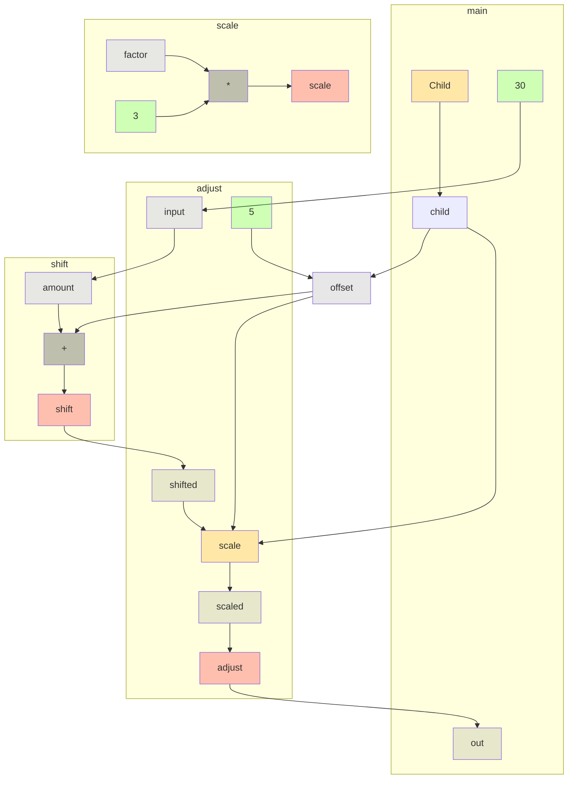

# parentMethod: spike value graph (condensed)

```mermaid
flowchart TD
  subgraph m0["main"]
    n0["Child"]:::EXTERNAL
    n1["30"]:::LITERAL
    n2["child"]:::OBJ_VARIABLE
    n3["out"]:::VARIABLE
  end
  subgraph m1["adjust"]
    n4["scale"]:::EXTERNAL
    n5["input"]:::FUNC_PARAM
    n6["5"]:::LITERAL
    n7["adjust"]:::RETURN
    n8["scaled"]:::VARIABLE
    n9["shifted"]:::VARIABLE
  end
  subgraph m2["scale"]
    n10["*"]:::BIN_OP
    n11["factor"]:::FUNC_PARAM
    n12["3"]:::LITERAL
    n13["scale"]:::RETURN
  end
  subgraph m3["shift"]
    n14["+"]:::BIN_OP
    n15["amount"]:::FUNC_PARAM
    n16["shift"]:::RETURN
  end
  n17["offset"]:::VARIABLE
  n0 --> n2
  n1 --> n5
  n10 --> n13
  n11 --> n10
  n12 --> n10
  n14 --> n16
  n15 --> n14
  n16 --> n9
  n17 --> n14
  n17 --> n4
  n2 --> n17
  n2 --> n4
  n4 --> n8
  n5 --> n15
  n6 --> n17
  n7 --> n3
  n8 --> n7
  n9 --> n4
  classDef LITERAL fill:#00FF0030
  classDef VARIABLE fill:#80808030
  classDef BIN_OP fill:#80808080
  classDef FUNC_PARAM fill:#8080FF30
  classDef RETURN fill:#FF808080
  classDef EXTERNAL fill:#FFA50040
  classDef UNMODELLED fill:#FF000030,stroke-dasharray: 4 2
```
