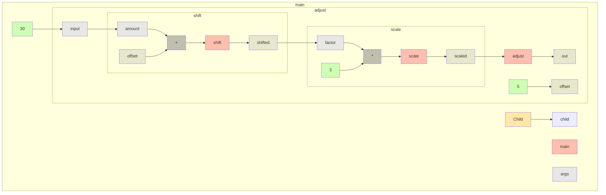

```mermaid
flowchart TD
  subgraph b0["main"]
    n1[main]:::RETURN
    n2[args]:::FUNC_PARAM
    n3[child]:::OBJ_VARIABLE
    n4[Child]:::EXTERNAL
    n5[out]:::VARIABLE
    n6[30]:::LITERAL
    n4[Child]:::EXTERNAL --> n3[child]:::OBJ_VARIABLE
    n6[30]:::LITERAL --> n9[input]:::FUNC_PARAM
    subgraph b7["adjust"]
      n8[adjust]:::RETURN
      n9[input]:::FUNC_PARAM
      n10[offset]:::VARIABLE
      n11[5]:::LITERAL
      n12[shifted]:::VARIABLE
      n18[scaled]:::VARIABLE
      n8[adjust]:::RETURN --> n5[out]:::VARIABLE
      n9[input]:::FUNC_PARAM --> n15[amount]:::FUNC_PARAM
      n11[5]:::LITERAL --> n10[offset]:::VARIABLE
      n12[shifted]:::VARIABLE --> n21[factor]:::FUNC_PARAM
      n18[scaled]:::VARIABLE --> n8[adjust]:::RETURN
      subgraph b13["shift"]
        n14[shift]:::RETURN
        n15[amount]:::FUNC_PARAM
        n16[offset]:::VARIABLE
        n17[+]:::BIN_OP
        n14[shift]:::RETURN --> n12[shifted]:::VARIABLE
        n15[amount]:::FUNC_PARAM --> n17[+]:::BIN_OP
        n16[offset]:::VARIABLE --> n17[+]:::BIN_OP
        n17[+]:::BIN_OP --> n14[shift]:::RETURN
      end
      subgraph b19["scale"]
        n20[scale]:::RETURN
        n21[factor]:::FUNC_PARAM
        n22[3]:::LITERAL
        n23[*]:::BIN_OP
        n20[scale]:::RETURN --> n18[scaled]:::VARIABLE
        n21[factor]:::FUNC_PARAM --> n23[*]:::BIN_OP
        n22[3]:::LITERAL --> n23[*]:::BIN_OP
        n23[*]:::BIN_OP --> n20[scale]:::RETURN
      end
    end
  end
  classDef LITERAL fill:#00FF0030
  classDef VARIABLE fill:#80808030
  classDef BIN_OP fill:#80808080
  classDef FUNC_PARAM fill:#8080FF30
  classDef RETURN fill:#FF808080
  classDef EXTERNAL fill:#FFA50040
```
