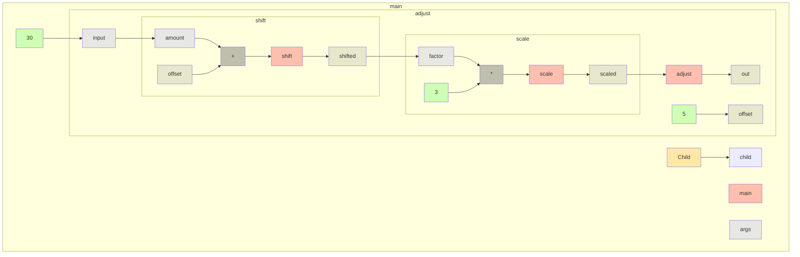

```mermaid
flowchart TD
  subgraph b0["main"]
    n1[main]:::RETURN
    n2[args]:::FUNC_PARAM
    n3[Child]:::EXTERNAL
    n4[child]:::OBJ_VARIABLE
    n5[30]:::LITERAL
    n23[out]:::VARIABLE
    n3[Child]:::EXTERNAL --> n4[child]:::OBJ_VARIABLE
    n5[30]:::LITERAL --> n8[input]:::FUNC_PARAM
    subgraph b6["adjust"]
      n7[adjust]:::RETURN
      n8[input]:::FUNC_PARAM
      n9[5]:::LITERAL
      n10[offset]:::VARIABLE
      n16[shifted]:::VARIABLE
      n22[scaled]:::VARIABLE
      n7[adjust]:::RETURN --> n23[out]:::VARIABLE
      n8[input]:::FUNC_PARAM --> n13[amount]:::FUNC_PARAM
      n9[5]:::LITERAL --> n10[offset]:::VARIABLE
      n16[shifted]:::VARIABLE --> n19[factor]:::FUNC_PARAM
      n22[scaled]:::VARIABLE --> n7[adjust]:::RETURN
      subgraph b11["shift"]
        n12[shift]:::RETURN
        n13[amount]:::FUNC_PARAM
        n14[offset]:::VARIABLE
        n15[+]:::BIN_OP
        n12[shift]:::RETURN --> n16[shifted]:::VARIABLE
        n13[amount]:::FUNC_PARAM --> n15[+]:::BIN_OP
        n14[offset]:::VARIABLE --> n15[+]:::BIN_OP
        n15[+]:::BIN_OP --> n12[shift]:::RETURN
      end
      subgraph b17["scale"]
        n18[scale]:::RETURN
        n19[factor]:::FUNC_PARAM
        n20[3]:::LITERAL
        n21[*]:::BIN_OP
        n18[scale]:::RETURN --> n22[scaled]:::VARIABLE
        n19[factor]:::FUNC_PARAM --> n21[*]:::BIN_OP
        n20[3]:::LITERAL --> n21[*]:::BIN_OP
        n21[*]:::BIN_OP --> n18[scale]:::RETURN
      end
    end
  end
  classDef LITERAL fill:#00FF0030
  classDef VARIABLE fill:#80808030
  classDef BIN_OP fill:#80808080
  classDef FUNC_PARAM fill:#8080FF30
  classDef RETURN fill:#FF808080
  classDef EXTERNAL fill:#FFA50040
```
