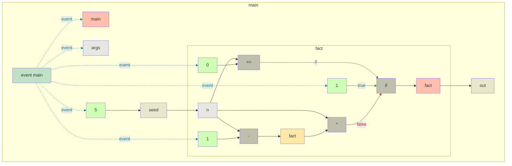

```mermaid
flowchart TD
  subgraph b0["main"]
    n1[event main]:::EVENT
    n2[main]:::RETURN
    n3[args]:::FUNC_PARAM
    n4[5]:::LITERAL
    n5[seed]:::VARIABLE
    n17[out]:::VARIABLE
    n1[event main]:::EVENT -. event .-> n2[main]:::RETURN
    n1[event main]:::EVENT -. event .-> n3[args]:::FUNC_PARAM
    n1[event main]:::EVENT -. event .-> n4[5]:::LITERAL
    n1[event main]:::EVENT -. event .-> n9[0]:::LITERAL
    n1[event main]:::EVENT -. event .-> n11[1]:::LITERAL
    n1[event main]:::EVENT -. event .-> n12[1]:::LITERAL
    n4[5]:::LITERAL --> n5[seed]:::VARIABLE
    n5[seed]:::VARIABLE --> n8[n]:::FUNC_PARAM
    n7[fact]:::RETURN --> n17[out]:::VARIABLE
    subgraph b6["fact"]
      n7[fact]:::RETURN
      n8[n]:::FUNC_PARAM
      n9[0]:::LITERAL
      n10[==]:::BIN_OP
      n11[1]:::LITERAL
      n12[1]:::LITERAL
      n13[-]:::BIN_OP
      n14[fact]:::EXTERNAL
      n15[*]:::BIN_OP
      n16[if]:::BIN_OP
      n8[n]:::FUNC_PARAM --> n10[==]:::BIN_OP
      n8[n]:::FUNC_PARAM --> n13[-]:::BIN_OP
      n8[n]:::FUNC_PARAM --> n15[*]:::BIN_OP
      n9[0]:::LITERAL --> n10[==]:::BIN_OP
      n10[==]:::BIN_OP -->|if| n16[if]:::BIN_OP
      n11[1]:::LITERAL -->|true| n16[if]:::BIN_OP
      n12[1]:::LITERAL --> n13[-]:::BIN_OP
      n13[-]:::BIN_OP --> n14[fact]:::EXTERNAL
      n14[fact]:::EXTERNAL --> n15[*]:::BIN_OP
      n15[*]:::BIN_OP -->|false| n16[if]:::BIN_OP
      n16[if]:::BIN_OP --> n7[fact]:::RETURN
    end
  end
  linkStyle 0 stroke:#00897b,color:#00897b
  linkStyle 1 stroke:#00897b,color:#00897b
  linkStyle 2 stroke:#00897b,color:#00897b
  linkStyle 3 stroke:#00897b,color:#00897b
  linkStyle 4 stroke:#00897b,color:#00897b
  linkStyle 5 stroke:#00897b,color:#00897b
  linkStyle 13 stroke:#6a6a6a,color:#6a6a6a
  linkStyle 14 stroke:#2e7d32,color:#2e7d32
  linkStyle 18 stroke:#c62828,color:#c62828
  classDef LITERAL fill:#00FF0030
  classDef VARIABLE fill:#80808030
  classDef BIN_OP fill:#80808080
  classDef FUNC_PARAM fill:#8080FF30
  classDef RETURN fill:#FF808080
  classDef EXTERNAL fill:#FFA50040
  classDef UNMODELLED fill:#FF000030,stroke-dasharray: 4 2
  classDef EVENT fill:#00897B40
```
