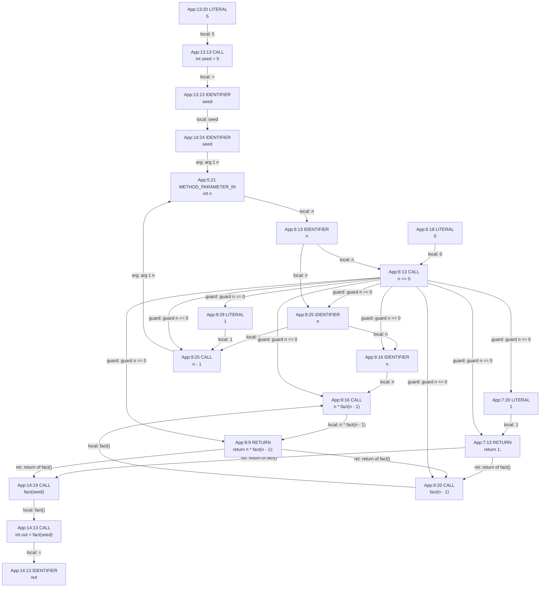

# recursion: spike value graph

```mermaid
flowchart TD
  n0["App:13:13 CALL<br/>int seed = 5"]
  n1["App:13:13 IDENTIFIER<br/>seed"]
  n2["App:13:20 LITERAL<br/>5"]
  n3["App:14:13 CALL<br/>int out = fact(seed)"]
  n4["App:14:13 IDENTIFIER<br/>out"]
  n5["App:14:19 CALL<br/>fact(seed)"]
  n6["App:14:24 IDENTIFIER<br/>seed"]
  n7["App:5:21 METHOD_PARAMETER_IN<br/>int n"]
  n8["App:6:13 CALL<br/>n == 0"]
  n9["App:6:13 IDENTIFIER<br/>n"]
  n10["App:6:18 LITERAL<br/>0"]
  n11["App:7:13 RETURN<br/>return 1;"]
  n12["App:7:20 LITERAL<br/>1"]
  n13["App:9:16 CALL<br/>n * fact(n - 1)"]
  n14["App:9:16 IDENTIFIER<br/>n"]
  n15["App:9:20 CALL<br/>fact(n - 1)"]
  n16["App:9:25 CALL<br/>n - 1"]
  n17["App:9:25 IDENTIFIER<br/>n"]
  n18["App:9:29 LITERAL<br/>1"]
  n19["App:9:9 RETURN<br/>return n * fact(n - 1);"]
  n0 -->|"local: ="| n1
  n1 -->|"local: seed"| n6
  n10 -->|"local: 0"| n8
  n11 -->|"ret: return of fact()"| n15
  n11 -->|"ret: return of fact()"| n5
  n12 -->|"local: 1"| n11
  n13 -->|"local: n * fact(n - 1)"| n19
  n14 -->|"local: n"| n13
  n15 -->|"local: fact()"| n13
  n16 -->|"arg: arg 1 n"| n7
  n17 -->|"local: n"| n14
  n17 -->|"local: n"| n16
  n18 -->|"local: 1"| n16
  n19 -->|"ret: return of fact()"| n15
  n19 -->|"ret: return of fact()"| n5
  n2 -->|"local: 5"| n0
  n3 -->|"local: ="| n4
  n5 -->|"local: fact()"| n3
  n6 -->|"arg: arg 1 n"| n7
  n7 -->|"local: n"| n9
  n8 -->|"guard: guard n == 0"| n11
  n8 -->|"guard: guard n == 0"| n12
  n8 -->|"guard: guard n == 0"| n13
  n8 -->|"guard: guard n == 0"| n14
  n8 -->|"guard: guard n == 0"| n15
  n8 -->|"guard: guard n == 0"| n16
  n8 -->|"guard: guard n == 0"| n17
  n8 -->|"guard: guard n == 0"| n18
  n8 -->|"guard: guard n == 0"| n19
  n9 -->|"local: n"| n17
  n9 -->|"local: n"| n8
```
