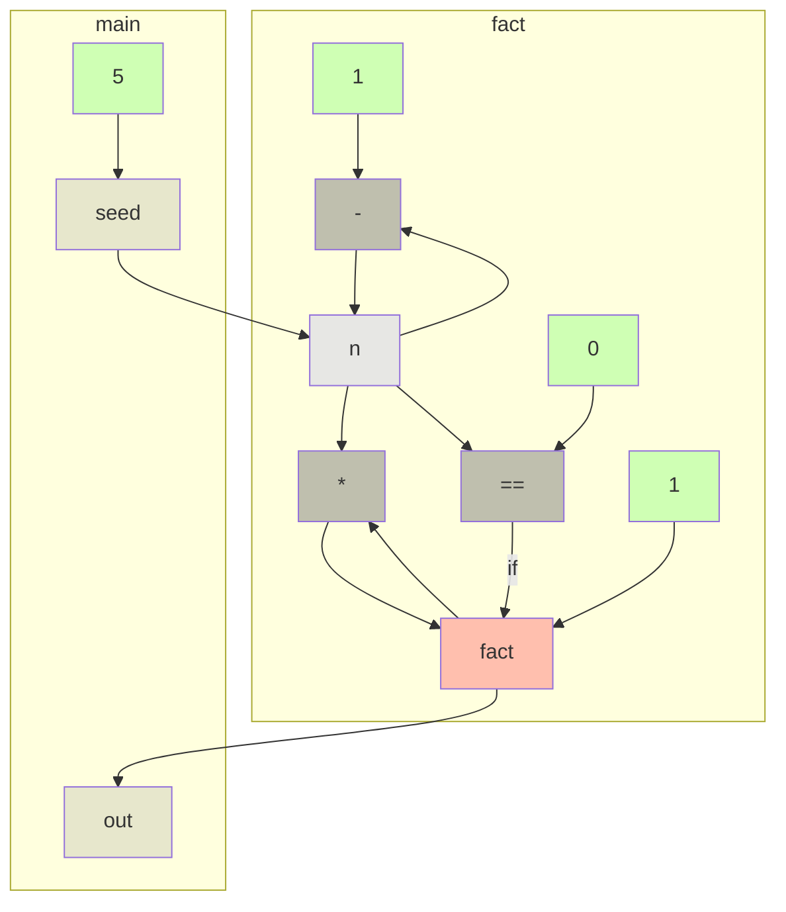

# recursion: spike value graph (condensed)

```mermaid
flowchart TD
  subgraph m0["fact"]
    n0["*"]:::BIN_OP
    n1["-"]:::BIN_OP
    n2["=="]:::BIN_OP
    n3["n"]:::FUNC_PARAM
    n4["0"]:::LITERAL
    n5["1"]:::LITERAL
    n6["1"]:::LITERAL
    n7["fact"]:::RETURN
  end
  subgraph m1["main"]
    n8["5"]:::LITERAL
    n9["out"]:::VARIABLE
    n10["seed"]:::VARIABLE
  end
  n0 --> n7
  n1 --> n3
  n10 --> n3
  n2 -->|if| n7
  n3 --> n0
  n3 --> n1
  n3 --> n2
  n4 --> n2
  n5 --> n7
  n6 --> n1
  n7 --> n0
  n7 --> n9
  n8 --> n10
  classDef LITERAL fill:#00FF0030
  classDef VARIABLE fill:#80808030
  classDef BIN_OP fill:#80808080
  classDef FUNC_PARAM fill:#8080FF30
  classDef RETURN fill:#FF808080
  classDef EXTERNAL fill:#FFA50040
  classDef UNMODELLED fill:#FF000030,stroke-dasharray: 4 2
```
