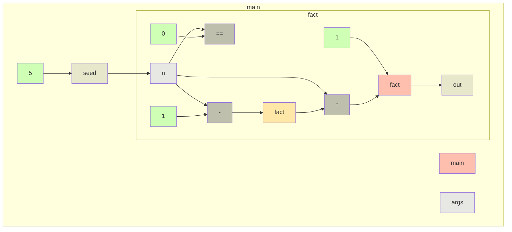

```mermaid
flowchart TD
  subgraph b0["main"]
    n1[main]:::RETURN
    n2[args]:::FUNC_PARAM
    n3[5]:::LITERAL
    n4[seed]:::VARIABLE
    n15[out]:::VARIABLE
    n3[5]:::LITERAL --> n4[seed]:::VARIABLE
    n4[seed]:::VARIABLE --> n7[n]:::FUNC_PARAM
    subgraph b5["fact"]
      n6[fact]:::RETURN
      n7[n]:::FUNC_PARAM
      n8[0]:::LITERAL
      n9[==]:::BIN_OP
      n10[1]:::LITERAL
      n11[1]:::LITERAL
      n12[-]:::BIN_OP
      n13[fact]:::EXTERNAL
      n14[*]:::BIN_OP
      n6[fact]:::RETURN --> n15[out]:::VARIABLE
      n7[n]:::FUNC_PARAM --> n9[==]:::BIN_OP
      n7[n]:::FUNC_PARAM --> n12[-]:::BIN_OP
      n7[n]:::FUNC_PARAM --> n14[*]:::BIN_OP
      n8[0]:::LITERAL --> n9[==]:::BIN_OP
      n10[1]:::LITERAL --> n6[fact]:::RETURN
      n11[1]:::LITERAL --> n12[-]:::BIN_OP
      n12[-]:::BIN_OP --> n13[fact]:::EXTERNAL
      n13[fact]:::EXTERNAL --> n14[*]:::BIN_OP
      n14[*]:::BIN_OP --> n6[fact]:::RETURN
    end
  end
  classDef LITERAL fill:#00FF0030
  classDef VARIABLE fill:#80808030
  classDef BIN_OP fill:#80808080
  classDef FUNC_PARAM fill:#8080FF30
  classDef RETURN fill:#FF808080
  classDef EXTERNAL fill:#FFA50040
  classDef UNMODELLED fill:#FF000030,stroke-dasharray: 4 2
```
