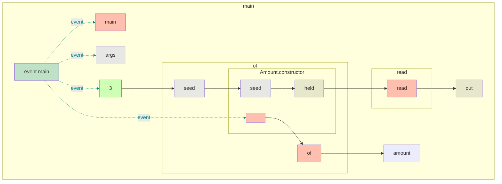

```mermaid
flowchart TD
  subgraph b0["main"]
    n1[event main]:::EVENT
    n2[main]:::RETURN
    n3[args]:::FUNC_PARAM
    n4[3]:::LITERAL
    n12[amount]:::OBJ_VARIABLE
    n15[out]:::VARIABLE
    n1[event main]:::EVENT -. event .-> n2[main]:::RETURN
    n1[event main]:::EVENT -. event .-> n3[args]:::FUNC_PARAM
    n1[event main]:::EVENT -. event .-> n4[3]:::LITERAL
    n1[event main]:::EVENT -. event .-> n9[<init>]:::RETURN
    n4[3]:::LITERAL --> n7[seed]:::FUNC_PARAM
    n6[of]:::RETURN --> n12[amount]:::OBJ_VARIABLE
    n11[held]:::VARIABLE --> n14[read]:::RETURN
    n14[read]:::RETURN --> n15[out]:::VARIABLE
    subgraph b5["of"]
      n6[of]:::RETURN
      n7[seed]:::FUNC_PARAM
      n7[seed]:::FUNC_PARAM --> n10[seed]:::FUNC_PARAM
      n9[<init>]:::RETURN --> n6[of]:::RETURN
      subgraph b8["Amount.constructor"]
        n9[<init>]:::RETURN
        n10[seed]:::FUNC_PARAM
        n11[held]:::VARIABLE
        n10[seed]:::FUNC_PARAM --> n11[held]:::VARIABLE
      end
    end
    subgraph b13["read"]
      n14[read]:::RETURN
    end
  end
  linkStyle 0 stroke:#00897b,color:#00897b
  linkStyle 1 stroke:#00897b,color:#00897b
  linkStyle 2 stroke:#00897b,color:#00897b
  linkStyle 3 stroke:#00897b,color:#00897b
  classDef LITERAL fill:#00FF0030
  classDef VARIABLE fill:#80808030
  classDef BIN_OP fill:#80808080
  classDef FUNC_PARAM fill:#8080FF30
  classDef RETURN fill:#FF808080
  classDef EXTERNAL fill:#FFA50040
  classDef UNMODELLED fill:#FF000030,stroke-dasharray: 4 2
  classDef EVENT fill:#00897B40
```
