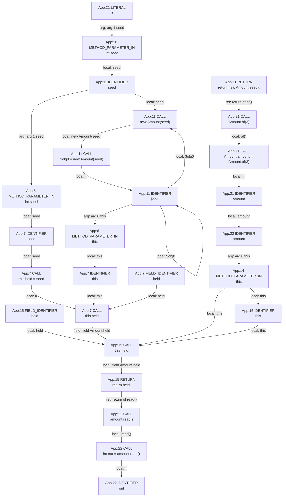

# returnedObject: spike value graph

```mermaid
flowchart TD
  n0["App:10 METHOD_PARAMETER_IN<br/>int seed"]
  n1["App:11 CALL<br/>$obj0 = new Amount(seed)"]
  n2["App:11 CALL<br/>new Amount(seed)"]
  n3["App:11 IDENTIFIER<br/>$obj0"]
  n4["App:11 IDENTIFIER<br/>seed"]
  n5["App:11 RETURN<br/>return new Amount(seed);"]
  n6["App:14 METHOD_PARAMETER_IN<br/>this"]
  n7["App:15 CALL<br/>this.held"]
  n8["App:15 FIELD_IDENTIFIER<br/>held"]
  n9["App:15 IDENTIFIER<br/>this"]
  n10["App:15 RETURN<br/>return held;"]
  n11["App:21 CALL<br/>Amount amount = Amount.of(3)"]
  n12["App:21 CALL<br/>Amount.of(3)"]
  n13["App:21 IDENTIFIER<br/>amount"]
  n14["App:21 LITERAL<br/>3"]
  n15["App:22 CALL<br/>amount.read()"]
  n16["App:22 CALL<br/>int out = amount.read()"]
  n17["App:22 IDENTIFIER<br/>amount"]
  n18["App:22 IDENTIFIER<br/>out"]
  n19["App:6 METHOD_PARAMETER_IN<br/>int seed"]
  n20["App:6 METHOD_PARAMETER_IN<br/>this"]
  n21["App:7 CALL<br/>this.held"]
  n22["App:7 CALL<br/>this.held = seed"]
  n23["App:7 FIELD_IDENTIFIER<br/>held"]
  n24["App:7 IDENTIFIER<br/>seed"]
  n25["App:7 IDENTIFIER<br/>this"]
  n0 -->|"local: seed"| n4
  n1 -->|"local: ="| n3
  n10 -->|"ret: return of read()"| n15
  n11 -->|"local: ="| n13
  n12 -->|"local: of()"| n11
  n13 -->|"local: amount"| n17
  n14 -->|"arg: arg 1 seed"| n0
  n15 -->|"local: read()"| n16
  n16 -->|"local: ="| n18
  n17 -->|"arg: arg 0 this"| n6
  n19 -->|"local: seed"| n24
  n2 -->|"local: new Amount(seed)"| n1
  n20 -->|"local: this"| n25
  n21 -->|"field: field Amount.held"| n7
  n22 -->|"local: ="| n21
  n23 -->|"local: held"| n21
  n24 -->|"local: seed"| n22
  n25 -->|"local: this"| n21
  n3 -->|"arg: arg 0 this"| n20
  n3 -->|"local: $obj0"| n2
  n3 -->|"local: $obj0"| n3
  n4 -->|"arg: arg 1 seed"| n19
  n4 -->|"local: seed"| n2
  n5 -->|"ret: return of of()"| n12
  n6 -->|"local: this"| n7
  n6 -->|"local: this"| n9
  n7 -->|"local: field Amount.held"| n10
  n8 -->|"local: held"| n7
  n9 -->|"local: this"| n7
```
