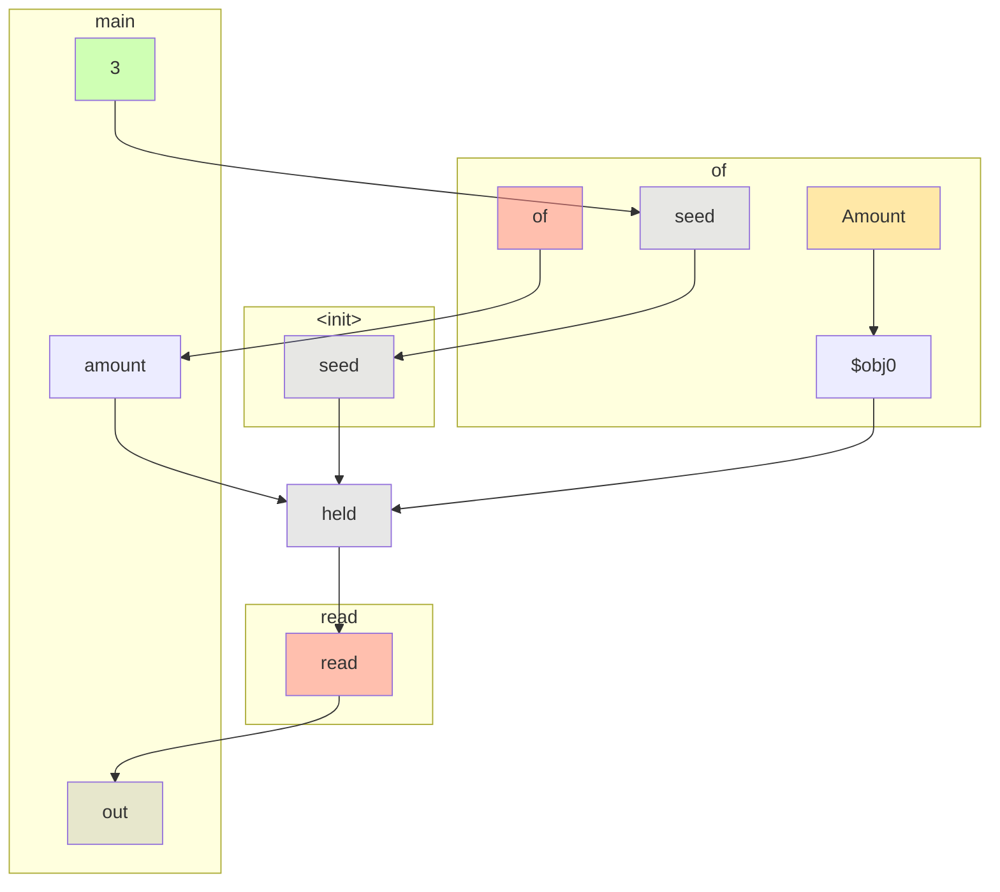

# returnedObject: spike value graph (condensed)

```mermaid
flowchart TD
  subgraph m0["#lt;init#gt;"]
    n0["seed"]:::FUNC_PARAM
  end
  subgraph m1["of"]
    n1["Amount"]:::EXTERNAL
    n2["seed"]:::FUNC_PARAM
    n3["of"]:::RETURN
    n4["$obj0"]:::OBJ_VARIABLE
  end
  subgraph m2["read"]
    n5["read"]:::RETURN
  end
  subgraph m3["main"]
    n6["3"]:::LITERAL
    n7["amount"]:::OBJ_VARIABLE
    n8["out"]:::VARIABLE
  end
  n9["held"]:::VARIABLE
  n0 --> n9
  n1 --> n4
  n2 --> n0
  n3 --> n7
  n4 --> n9
  n5 --> n8
  n6 --> n2
  n7 --> n9
  n9 --> n5
  classDef LITERAL fill:#00FF0030
  classDef VARIABLE fill:#80808030
  classDef BIN_OP fill:#80808080
  classDef FUNC_PARAM fill:#8080FF30
  classDef RETURN fill:#FF808080
  classDef EXTERNAL fill:#FFA50040
  classDef UNMODELLED fill:#FF000030,stroke-dasharray: 4 2
```
