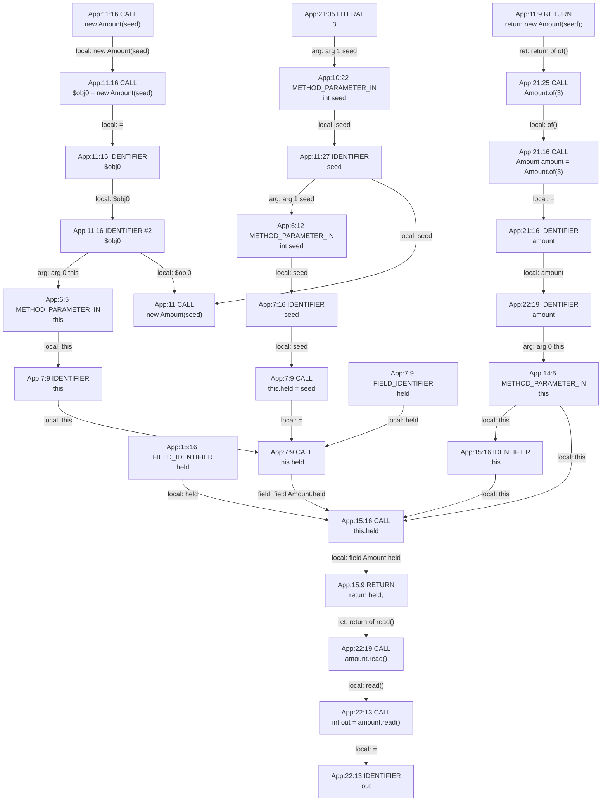

# returnedObject: spike value graph

```mermaid
flowchart TD
  n0["App:10:22 METHOD_PARAMETER_IN<br/>int seed"]
  n1["App:11 CALL<br/>new Amount(seed)"]
  n2["App:11:16 CALL<br/>$obj0 = new Amount(seed)"]
  n3["App:11:16 CALL<br/>new Amount(seed)"]
  n4["App:11:16 IDENTIFIER #2<br/>$obj0"]
  n5["App:11:16 IDENTIFIER<br/>$obj0"]
  n6["App:11:27 IDENTIFIER<br/>seed"]
  n7["App:11:9 RETURN<br/>return new Amount(seed);"]
  n8["App:14:5 METHOD_PARAMETER_IN<br/>this"]
  n9["App:15:16 CALL<br/>this.held"]
  n10["App:15:16 FIELD_IDENTIFIER<br/>held"]
  n11["App:15:16 IDENTIFIER<br/>this"]
  n12["App:15:9 RETURN<br/>return held;"]
  n13["App:21:16 CALL<br/>Amount amount = Amount.of(3)"]
  n14["App:21:16 IDENTIFIER<br/>amount"]
  n15["App:21:25 CALL<br/>Amount.of(3)"]
  n16["App:21:35 LITERAL<br/>3"]
  n17["App:22:13 CALL<br/>int out = amount.read()"]
  n18["App:22:13 IDENTIFIER<br/>out"]
  n19["App:22:19 CALL<br/>amount.read()"]
  n20["App:22:19 IDENTIFIER<br/>amount"]
  n21["App:6:12 METHOD_PARAMETER_IN<br/>int seed"]
  n22["App:6:5 METHOD_PARAMETER_IN<br/>this"]
  n23["App:7:16 IDENTIFIER<br/>seed"]
  n24["App:7:9 CALL<br/>this.held"]
  n25["App:7:9 CALL<br/>this.held = seed"]
  n26["App:7:9 FIELD_IDENTIFIER<br/>held"]
  n27["App:7:9 IDENTIFIER<br/>this"]
  n0 -->|"local: seed"| n6
  n10 -->|"local: held"| n9
  n11 -->|"local: this"| n9
  n12 -->|"ret: return of read()"| n19
  n13 -->|"local: ="| n14
  n14 -->|"local: amount"| n20
  n15 -->|"local: of()"| n13
  n16 -->|"arg: arg 1 seed"| n0
  n17 -->|"local: ="| n18
  n19 -->|"local: read()"| n17
  n2 -->|"local: ="| n5
  n20 -->|"arg: arg 0 this"| n8
  n21 -->|"local: seed"| n23
  n22 -->|"local: this"| n27
  n23 -->|"local: seed"| n25
  n24 -->|"field: field Amount.held"| n9
  n25 -->|"local: ="| n24
  n26 -->|"local: held"| n24
  n27 -->|"local: this"| n24
  n3 -->|"local: new Amount(seed)"| n2
  n4 -->|"arg: arg 0 this"| n22
  n4 -->|"local: $obj0"| n1
  n5 -->|"local: $obj0"| n4
  n6 -->|"arg: arg 1 seed"| n21
  n6 -->|"local: seed"| n1
  n7 -->|"ret: return of of()"| n15
  n8 -->|"local: this"| n11
  n8 -->|"local: this"| n9
  n9 -->|"local: field Amount.held"| n12
```
