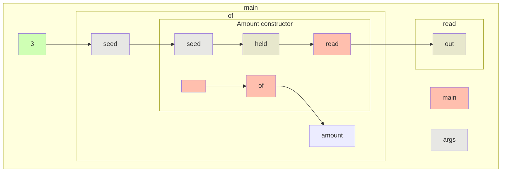

```mermaid
flowchart TD
  subgraph b0["main"]
    n1[main]:::RETURN
    n2[args]:::FUNC_PARAM
    n3[amount]:::OBJ_VARIABLE
    n4[3]:::LITERAL
    n12[out]:::VARIABLE
    n4[3]:::LITERAL --> n7[seed]:::FUNC_PARAM
    subgraph b5["of"]
      n6[of]:::RETURN
      n7[seed]:::FUNC_PARAM
      n6[of]:::RETURN --> n3[amount]:::OBJ_VARIABLE
      n7[seed]:::FUNC_PARAM --> n10[seed]:::FUNC_PARAM
      subgraph b8["Amount.constructor"]
        n9[<init>]:::RETURN
        n10[seed]:::FUNC_PARAM
        n11[held]:::VARIABLE
        n9[<init>]:::RETURN --> n6[of]:::RETURN
        n10[seed]:::FUNC_PARAM --> n11[held]:::VARIABLE
        n11[held]:::VARIABLE --> n14[read]:::RETURN
      end
    end
    subgraph b13["read"]
      n14[read]:::RETURN
      n14[read]:::RETURN --> n12[out]:::VARIABLE
    end
  end
  classDef LITERAL fill:#00FF0030
  classDef VARIABLE fill:#80808030
  classDef BIN_OP fill:#80808080
  classDef FUNC_PARAM fill:#8080FF30
  classDef RETURN fill:#FF808080
  classDef EXTERNAL fill:#FFA50040
```
