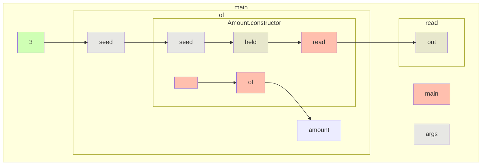

```mermaid
flowchart TD
  subgraph b0["main"]
    n1[main]:::RETURN
    n2[args]:::FUNC_PARAM
    n3[3]:::LITERAL
    n11[amount]:::OBJ_VARIABLE
    n14[out]:::VARIABLE
    n3[3]:::LITERAL --> n6[seed]:::FUNC_PARAM
    subgraph b4["of"]
      n5[of]:::RETURN
      n6[seed]:::FUNC_PARAM
      n5[of]:::RETURN --> n11[amount]:::OBJ_VARIABLE
      n6[seed]:::FUNC_PARAM --> n9[seed]:::FUNC_PARAM
      subgraph b7["Amount.constructor"]
        n8[<init>]:::RETURN
        n9[seed]:::FUNC_PARAM
        n10[held]:::VARIABLE
        n8[<init>]:::RETURN --> n5[of]:::RETURN
        n9[seed]:::FUNC_PARAM --> n10[held]:::VARIABLE
        n10[held]:::VARIABLE --> n13[read]:::RETURN
      end
    end
    subgraph b12["read"]
      n13[read]:::RETURN
      n13[read]:::RETURN --> n14[out]:::VARIABLE
    end
  end
  classDef LITERAL fill:#00FF0030
  classDef VARIABLE fill:#80808030
  classDef BIN_OP fill:#80808080
  classDef FUNC_PARAM fill:#8080FF30
  classDef RETURN fill:#FF808080
  classDef EXTERNAL fill:#FFA50040
  classDef UNMODELLED fill:#FF000030,stroke-dasharray: 4 2
```
