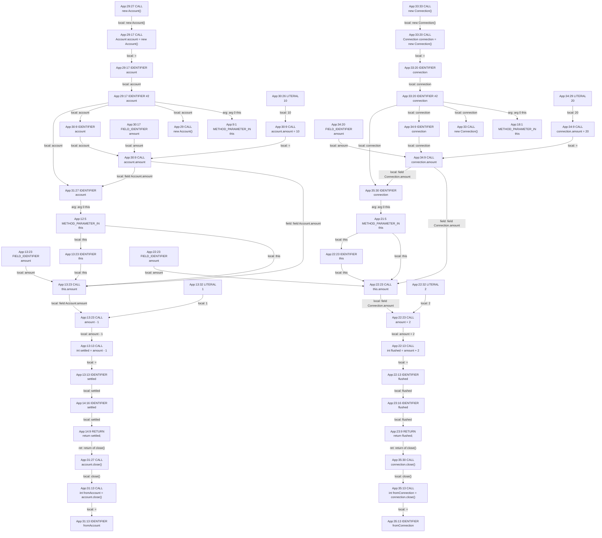

# sameName: spike value graph

```mermaid
flowchart TD
  n0["App:12:5 METHOD_PARAMETER_IN<br/>this"]
  n1["App:13:13 CALL<br/>int settled = amount - 1"]
  n2["App:13:13 IDENTIFIER<br/>settled"]
  n3["App:13:23 CALL<br/>amount - 1"]
  n4["App:13:23 CALL<br/>this.amount"]
  n5["App:13:23 FIELD_IDENTIFIER<br/>amount"]
  n6["App:13:23 IDENTIFIER<br/>this"]
  n7["App:13:32 LITERAL<br/>1"]
  n8["App:14:16 IDENTIFIER<br/>settled"]
  n9["App:14:9 RETURN<br/>return settled;"]
  n10["App:18:1 METHOD_PARAMETER_IN<br/>this"]
  n11["App:21:5 METHOD_PARAMETER_IN<br/>this"]
  n12["App:22:13 CALL<br/>int flushed = amount + 2"]
  n13["App:22:13 IDENTIFIER<br/>flushed"]
  n14["App:22:23 CALL<br/>amount + 2"]
  n15["App:22:23 CALL<br/>this.amount"]
  n16["App:22:23 FIELD_IDENTIFIER<br/>amount"]
  n17["App:22:23 IDENTIFIER<br/>this"]
  n18["App:22:32 LITERAL<br/>2"]
  n19["App:23:16 IDENTIFIER<br/>flushed"]
  n20["App:23:9 RETURN<br/>return flushed;"]
  n21["App:29 CALL<br/>new Account()"]
  n22["App:29:17 CALL<br/>Account account = new Account()"]
  n23["App:29:17 IDENTIFIER #2<br/>account"]
  n24["App:29:17 IDENTIFIER<br/>account"]
  n25["App:29:27 CALL<br/>new Account()"]
  n26["App:30:17 FIELD_IDENTIFIER<br/>amount"]
  n27["App:30:26 LITERAL<br/>10"]
  n28["App:30:9 CALL<br/>account.amount"]
  n29["App:30:9 CALL<br/>account.amount = 10"]
  n30["App:30:9 IDENTIFIER<br/>account"]
  n31["App:31:13 CALL<br/>int fromAccount = account.close()"]
  n32["App:31:13 IDENTIFIER<br/>fromAccount"]
  n33["App:31:27 CALL<br/>account.close()"]
  n34["App:31:27 IDENTIFIER<br/>account"]
  n35["App:33 CALL<br/>new Connection()"]
  n36["App:33:20 CALL<br/>Connection connection = new Connection()"]
  n37["App:33:20 IDENTIFIER #2<br/>connection"]
  n38["App:33:20 IDENTIFIER<br/>connection"]
  n39["App:33:33 CALL<br/>new Connection()"]
  n40["App:34:20 FIELD_IDENTIFIER<br/>amount"]
  n41["App:34:29 LITERAL<br/>20"]
  n42["App:34:9 CALL<br/>connection.amount"]
  n43["App:34:9 CALL<br/>connection.amount = 20"]
  n44["App:34:9 IDENTIFIER<br/>connection"]
  n45["App:35:13 CALL<br/>int fromConnection = connection.close()"]
  n46["App:35:13 IDENTIFIER<br/>fromConnection"]
  n47["App:35:30 CALL<br/>connection.close()"]
  n48["App:35:30 IDENTIFIER<br/>connection"]
  n49["App:9:1 METHOD_PARAMETER_IN<br/>this"]
  n0 -->|"local: this"| n4
  n0 -->|"local: this"| n6
  n1 -->|"local: ="| n2
  n11 -->|"local: this"| n15
  n11 -->|"local: this"| n17
  n12 -->|"local: ="| n13
  n13 -->|"local: flushed"| n19
  n14 -->|"local: amount + 2"| n12
  n15 -->|"local: field Connection.amount"| n14
  n16 -->|"local: amount"| n15
  n17 -->|"local: this"| n15
  n18 -->|"local: 2"| n14
  n19 -->|"local: flushed"| n20
  n2 -->|"local: settled"| n8
  n20 -->|"ret: return of close()"| n47
  n22 -->|"local: ="| n24
  n23 -->|"arg: arg 0 this"| n49
  n23 -->|"local: account"| n21
  n23 -->|"local: account"| n30
  n23 -->|"local: account"| n34
  n24 -->|"local: account"| n23
  n25 -->|"local: new Account()"| n22
  n26 -->|"local: amount"| n28
  n27 -->|"local: 10"| n29
  n28 -->|"field: field Account.amount"| n4
  n28 -->|"local: field Account.amount"| n34
  n29 -->|"local: ="| n28
  n3 -->|"local: amount - 1"| n1
  n30 -->|"local: account"| n28
  n31 -->|"local: ="| n32
  n33 -->|"local: close()"| n31
  n34 -->|"arg: arg 0 this"| n0
  n36 -->|"local: ="| n38
  n37 -->|"arg: arg 0 this"| n10
  n37 -->|"local: connection"| n35
  n37 -->|"local: connection"| n44
  n37 -->|"local: connection"| n48
  n38 -->|"local: connection"| n37
  n39 -->|"local: new Connection()"| n36
  n4 -->|"local: field Account.amount"| n3
  n40 -->|"local: amount"| n42
  n41 -->|"local: 20"| n43
  n42 -->|"field: field Connection.amount"| n15
  n42 -->|"local: field Connection.amount"| n48
  n43 -->|"local: ="| n42
  n44 -->|"local: connection"| n42
  n45 -->|"local: ="| n46
  n47 -->|"local: close()"| n45
  n48 -->|"arg: arg 0 this"| n11
  n5 -->|"local: amount"| n4
  n6 -->|"local: this"| n4
  n7 -->|"local: 1"| n3
  n8 -->|"local: settled"| n9
  n9 -->|"ret: return of close()"| n33
```
