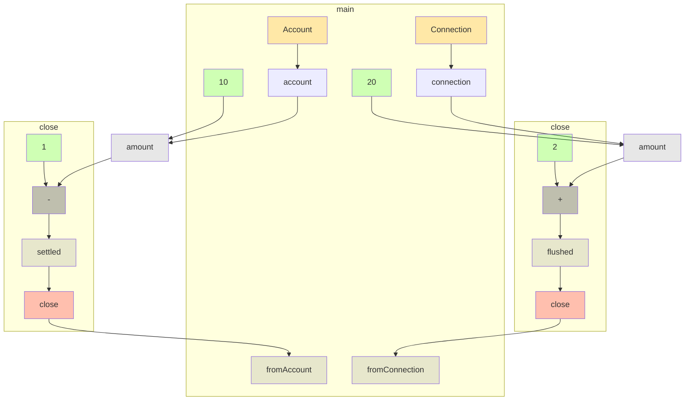

# sameName: spike value graph (condensed)

```mermaid
flowchart TD
  subgraph m0["close"]
    n0["-"]:::BIN_OP
    n1["1"]:::LITERAL
    n2["close"]:::RETURN
    n3["settled"]:::VARIABLE
  end
  subgraph m1["main"]
    n4["Account"]:::EXTERNAL
    n5["Connection"]:::EXTERNAL
    n6["10"]:::LITERAL
    n7["20"]:::LITERAL
    n8["account"]:::OBJ_VARIABLE
    n9["connection"]:::OBJ_VARIABLE
    n10["fromAccount"]:::VARIABLE
    n11["fromConnection"]:::VARIABLE
  end
  subgraph m2["close"]
    n12["+"]:::BIN_OP
    n13["2"]:::LITERAL
    n14["close"]:::RETURN
    n15["flushed"]:::VARIABLE
  end
  n16["amount"]:::VARIABLE
  n17["amount"]:::VARIABLE
  n0 --> n3
  n1 --> n0
  n12 --> n15
  n13 --> n12
  n14 --> n11
  n15 --> n14
  n16 --> n0
  n17 --> n12
  n2 --> n10
  n3 --> n2
  n4 --> n8
  n5 --> n9
  n6 --> n16
  n7 --> n17
  n8 --> n16
  n9 --> n17
  classDef LITERAL fill:#00FF0030
  classDef VARIABLE fill:#80808030
  classDef BIN_OP fill:#80808080
  classDef FUNC_PARAM fill:#8080FF30
  classDef RETURN fill:#FF808080
  classDef EXTERNAL fill:#FFA50040
  classDef UNMODELLED fill:#FF000030,stroke-dasharray: 4 2
```
