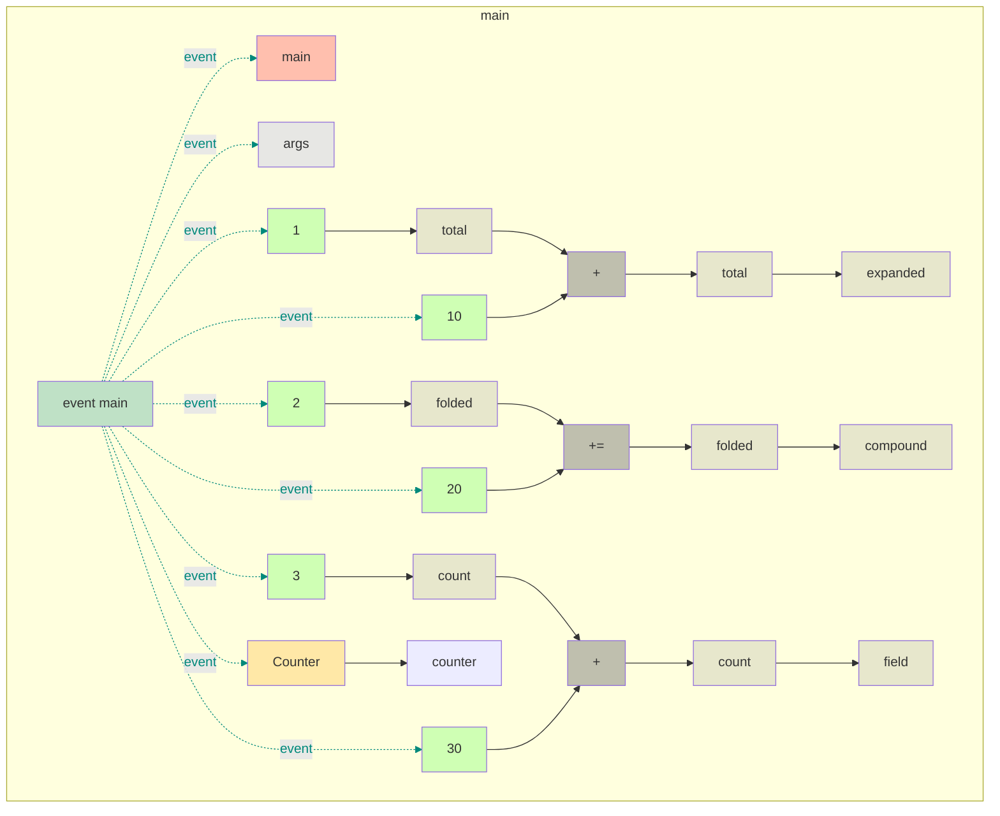

```mermaid
flowchart TD
  subgraph b0["main"]
    n1[event main]:::EVENT
    n2[main]:::RETURN
    n3[args]:::FUNC_PARAM
    n4[1]:::LITERAL
    n5[total]:::VARIABLE
    n6[10]:::LITERAL
    n7[+]:::BIN_OP
    n8[total]:::VARIABLE
    n9[expanded]:::VARIABLE
    n10[2]:::LITERAL
    n11[folded]:::VARIABLE
    n12[20]:::LITERAL
    n13[+=]:::BIN_OP
    n14[folded]:::VARIABLE
    n15[compound]:::VARIABLE
    n16[Counter]:::EXTERNAL
    n17[counter]:::OBJ_VARIABLE
    n18[3]:::LITERAL
    n19[count]:::VARIABLE
    n20[30]:::LITERAL
    n21[+]:::BIN_OP
    n22[count]:::VARIABLE
    n23[field]:::VARIABLE
    n1[event main]:::EVENT -. event .-> n2[main]:::RETURN
    n1[event main]:::EVENT -. event .-> n3[args]:::FUNC_PARAM
    n1[event main]:::EVENT -. event .-> n4[1]:::LITERAL
    n1[event main]:::EVENT -. event .-> n6[10]:::LITERAL
    n1[event main]:::EVENT -. event .-> n10[2]:::LITERAL
    n1[event main]:::EVENT -. event .-> n12[20]:::LITERAL
    n1[event main]:::EVENT -. event .-> n16[Counter]:::EXTERNAL
    n1[event main]:::EVENT -. event .-> n18[3]:::LITERAL
    n1[event main]:::EVENT -. event .-> n20[30]:::LITERAL
    n4[1]:::LITERAL --> n5[total]:::VARIABLE
    n5[total]:::VARIABLE --> n7[+]:::BIN_OP
    n6[10]:::LITERAL --> n7[+]:::BIN_OP
    n7[+]:::BIN_OP --> n8[total]:::VARIABLE
    n8[total]:::VARIABLE --> n9[expanded]:::VARIABLE
    n10[2]:::LITERAL --> n11[folded]:::VARIABLE
    n11[folded]:::VARIABLE --> n13[+=]:::BIN_OP
    n12[20]:::LITERAL --> n13[+=]:::BIN_OP
    n13[+=]:::BIN_OP --> n14[folded]:::VARIABLE
    n14[folded]:::VARIABLE --> n15[compound]:::VARIABLE
    n16[Counter]:::EXTERNAL --> n17[counter]:::OBJ_VARIABLE
    n18[3]:::LITERAL --> n19[count]:::VARIABLE
    n19[count]:::VARIABLE --> n21[+]:::BIN_OP
    n20[30]:::LITERAL --> n21[+]:::BIN_OP
    n21[+]:::BIN_OP --> n22[count]:::VARIABLE
    n22[count]:::VARIABLE --> n23[field]:::VARIABLE
  end
  linkStyle 0 stroke:#00897b,color:#00897b
  linkStyle 1 stroke:#00897b,color:#00897b
  linkStyle 2 stroke:#00897b,color:#00897b
  linkStyle 3 stroke:#00897b,color:#00897b
  linkStyle 4 stroke:#00897b,color:#00897b
  linkStyle 5 stroke:#00897b,color:#00897b
  linkStyle 6 stroke:#00897b,color:#00897b
  linkStyle 7 stroke:#00897b,color:#00897b
  linkStyle 8 stroke:#00897b,color:#00897b
  classDef LITERAL fill:#00FF0030
  classDef VARIABLE fill:#80808030
  classDef BIN_OP fill:#80808080
  classDef FUNC_PARAM fill:#8080FF30
  classDef RETURN fill:#FF808080
  classDef EXTERNAL fill:#FFA50040
  classDef UNMODELLED fill:#FF000030,stroke-dasharray: 4 2
  classDef EVENT fill:#00897B40
```
