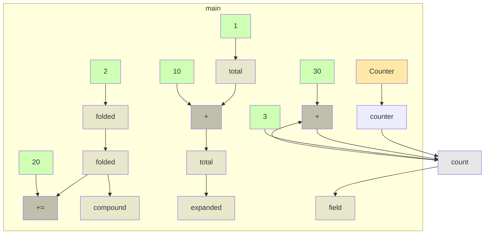

# selfAssignment: spike value graph (condensed)

```mermaid
flowchart TD
  subgraph m0["main"]
    n0["+="]:::BIN_OP
    n1["+"]:::BIN_OP
    n2["+"]:::BIN_OP
    n3["Counter"]:::EXTERNAL
    n4["10"]:::LITERAL
    n5["1"]:::LITERAL
    n6["20"]:::LITERAL
    n7["2"]:::LITERAL
    n8["30"]:::LITERAL
    n9["3"]:::LITERAL
    n10["counter"]:::OBJ_VARIABLE
    n11["compound"]:::VARIABLE
    n12["expanded"]:::VARIABLE
    n13["field"]:::VARIABLE
    n14["folded"]:::VARIABLE
    n15["folded"]:::VARIABLE
    n16["total"]:::VARIABLE
    n17["total"]:::VARIABLE
  end
  n18["count"]:::VARIABLE
  n1 --> n17
  n10 --> n18
  n14 --> n15
  n15 --> n0
  n15 --> n11
  n16 --> n1
  n17 --> n12
  n18 --> n13
  n18 --> n2
  n2 --> n18
  n3 --> n10
  n4 --> n1
  n5 --> n16
  n6 --> n0
  n7 --> n14
  n8 --> n2
  n9 --> n18
  classDef LITERAL fill:#00FF0030
  classDef VARIABLE fill:#80808030
  classDef BIN_OP fill:#80808080
  classDef FUNC_PARAM fill:#8080FF30
  classDef RETURN fill:#FF808080
  classDef EXTERNAL fill:#FFA50040
  classDef UNMODELLED fill:#FF000030,stroke-dasharray: 4 2
```
