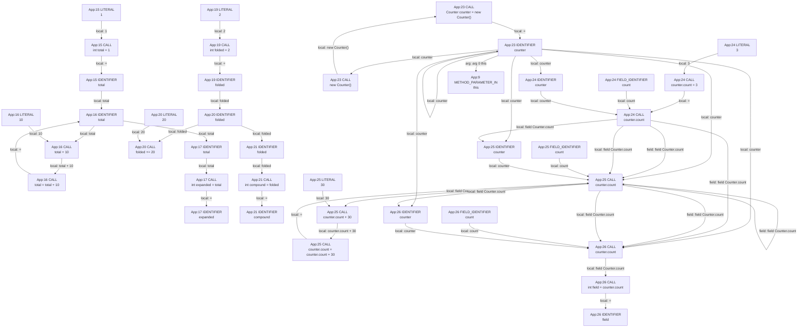

# selfAssignment: spike value graph

```mermaid
flowchart TD
  n0["App:15 CALL<br/>int total = 1"]
  n1["App:15 IDENTIFIER<br/>total"]
  n2["App:15 LITERAL<br/>1"]
  n3["App:16 CALL<br/>total + 10"]
  n4["App:16 CALL<br/>total = total + 10"]
  n5["App:16 IDENTIFIER<br/>total"]
  n6["App:16 LITERAL<br/>10"]
  n7["App:17 CALL<br/>int expanded = total"]
  n8["App:17 IDENTIFIER<br/>expanded"]
  n9["App:17 IDENTIFIER<br/>total"]
  n10["App:19 CALL<br/>int folded = 2"]
  n11["App:19 IDENTIFIER<br/>folded"]
  n12["App:19 LITERAL<br/>2"]
  n13["App:20 CALL<br/>folded += 20"]
  n14["App:20 IDENTIFIER<br/>folded"]
  n15["App:20 LITERAL<br/>20"]
  n16["App:21 CALL<br/>int compound = folded"]
  n17["App:21 IDENTIFIER<br/>compound"]
  n18["App:21 IDENTIFIER<br/>folded"]
  n19["App:23 CALL<br/>Counter counter = new Counter()"]
  n20["App:23 CALL<br/>new Counter()"]
  n21["App:23 IDENTIFIER<br/>counter"]
  n22["App:24 CALL<br/>counter.count"]
  n23["App:24 CALL<br/>counter.count = 3"]
  n24["App:24 FIELD_IDENTIFIER<br/>count"]
  n25["App:24 IDENTIFIER<br/>counter"]
  n26["App:24 LITERAL<br/>3"]
  n27["App:25 CALL<br/>counter.count"]
  n28["App:25 CALL<br/>counter.count + 30"]
  n29["App:25 CALL<br/>counter.count = counter.count + 30"]
  n30["App:25 FIELD_IDENTIFIER<br/>count"]
  n31["App:25 IDENTIFIER<br/>counter"]
  n32["App:25 LITERAL<br/>30"]
  n33["App:26 CALL<br/>counter.count"]
  n34["App:26 CALL<br/>int field = counter.count"]
  n35["App:26 FIELD_IDENTIFIER<br/>count"]
  n36["App:26 IDENTIFIER<br/>counter"]
  n37["App:26 IDENTIFIER<br/>field"]
  n38["App:9 METHOD_PARAMETER_IN<br/>this"]
  n0 -->|"local: ="| n1
  n1 -->|"local: total"| n5
  n10 -->|"local: ="| n11
  n11 -->|"local: folded"| n14
  n12 -->|"local: 2"| n10
  n14 -->|"local: folded"| n13
  n14 -->|"local: folded"| n18
  n15 -->|"local: 20"| n13
  n16 -->|"local: ="| n17
  n18 -->|"local: folded"| n16
  n19 -->|"local: ="| n21
  n2 -->|"local: 1"| n0
  n20 -->|"local: new Counter()"| n19
  n21 -->|"arg: arg 0 this"| n38
  n21 -->|"local: counter"| n20
  n21 -->|"local: counter"| n21
  n21 -->|"local: counter"| n25
  n21 -->|"local: counter"| n27
  n21 -->|"local: counter"| n31
  n21 -->|"local: counter"| n33
  n21 -->|"local: counter"| n36
  n22 -->|"field: field Counter.count"| n27
  n22 -->|"field: field Counter.count"| n33
  n22 -->|"local: field Counter.count"| n27
  n22 -->|"local: field Counter.count"| n31
  n23 -->|"local: ="| n22
  n24 -->|"local: count"| n22
  n25 -->|"local: counter"| n22
  n26 -->|"local: 3"| n23
  n27 -->|"field: field Counter.count"| n27
  n27 -->|"field: field Counter.count"| n33
  n27 -->|"local: field Counter.count"| n28
  n27 -->|"local: field Counter.count"| n33
  n27 -->|"local: field Counter.count"| n36
  n28 -->|"local: counter.count + 30"| n29
  n29 -->|"local: ="| n27
  n3 -->|"local: total + 10"| n4
  n30 -->|"local: count"| n27
  n31 -->|"local: counter"| n27
  n32 -->|"local: 30"| n28
  n33 -->|"local: field Counter.count"| n34
  n34 -->|"local: ="| n37
  n35 -->|"local: count"| n33
  n36 -->|"local: counter"| n33
  n4 -->|"local: ="| n5
  n5 -->|"local: total"| n3
  n5 -->|"local: total"| n9
  n6 -->|"local: 10"| n3
  n7 -->|"local: ="| n8
  n9 -->|"local: total"| n7
```
