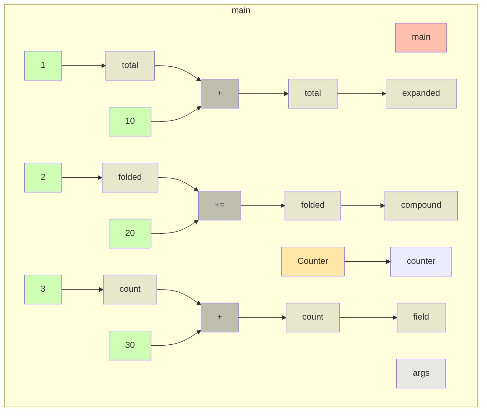

```mermaid
flowchart TD
  subgraph b0["main"]
    n1[main]:::RETURN
    n2[args]:::FUNC_PARAM
    n3[1]:::LITERAL
    n4[total]:::VARIABLE
    n5[10]:::LITERAL
    n6[+]:::BIN_OP
    n7[total]:::VARIABLE
    n8[expanded]:::VARIABLE
    n9[2]:::LITERAL
    n10[folded]:::VARIABLE
    n11[20]:::LITERAL
    n12[+=]:::BIN_OP
    n13[folded]:::VARIABLE
    n14[compound]:::VARIABLE
    n15[Counter]:::EXTERNAL
    n16[counter]:::OBJ_VARIABLE
    n17[3]:::LITERAL
    n18[count]:::VARIABLE
    n19[30]:::LITERAL
    n20[+]:::BIN_OP
    n21[count]:::VARIABLE
    n22[field]:::VARIABLE
    n3[1]:::LITERAL --> n4[total]:::VARIABLE
    n4[total]:::VARIABLE --> n6[+]:::BIN_OP
    n5[10]:::LITERAL --> n6[+]:::BIN_OP
    n6[+]:::BIN_OP --> n7[total]:::VARIABLE
    n7[total]:::VARIABLE --> n8[expanded]:::VARIABLE
    n9[2]:::LITERAL --> n10[folded]:::VARIABLE
    n10[folded]:::VARIABLE --> n12[+=]:::BIN_OP
    n11[20]:::LITERAL --> n12[+=]:::BIN_OP
    n12[+=]:::BIN_OP --> n13[folded]:::VARIABLE
    n13[folded]:::VARIABLE --> n14[compound]:::VARIABLE
    n15[Counter]:::EXTERNAL --> n16[counter]:::OBJ_VARIABLE
    n17[3]:::LITERAL --> n18[count]:::VARIABLE
    n18[count]:::VARIABLE --> n20[+]:::BIN_OP
    n19[30]:::LITERAL --> n20[+]:::BIN_OP
    n20[+]:::BIN_OP --> n21[count]:::VARIABLE
    n21[count]:::VARIABLE --> n22[field]:::VARIABLE
  end
  classDef LITERAL fill:#00FF0030
  classDef VARIABLE fill:#80808030
  classDef BIN_OP fill:#80808080
  classDef FUNC_PARAM fill:#8080FF30
  classDef RETURN fill:#FF808080
  classDef EXTERNAL fill:#FFA50040
```
