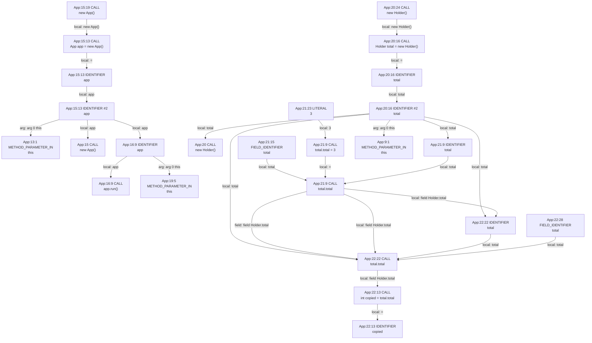

# shadowedType: spike value graph

```mermaid
flowchart TD
  n0["App:13:1 METHOD_PARAMETER_IN<br/>this"]
  n1["App:15 CALL<br/>new App()"]
  n2["App:15:13 CALL<br/>App app = new App()"]
  n3["App:15:13 IDENTIFIER #2<br/>app"]
  n4["App:15:13 IDENTIFIER<br/>app"]
  n5["App:15:19 CALL<br/>new App()"]
  n6["App:16:9 CALL<br/>app.run()"]
  n7["App:16:9 IDENTIFIER<br/>app"]
  n8["App:19:5 METHOD_PARAMETER_IN<br/>this"]
  n9["App:20 CALL<br/>new Holder()"]
  n10["App:20:16 CALL<br/>Holder total = new Holder()"]
  n11["App:20:16 IDENTIFIER #2<br/>total"]
  n12["App:20:16 IDENTIFIER<br/>total"]
  n13["App:20:24 CALL<br/>new Holder()"]
  n14["App:21:15 FIELD_IDENTIFIER<br/>total"]
  n15["App:21:23 LITERAL<br/>3"]
  n16["App:21:9 CALL<br/>total.total"]
  n17["App:21:9 CALL<br/>total.total = 3"]
  n18["App:21:9 IDENTIFIER<br/>total"]
  n19["App:22:13 CALL<br/>int copied = total.total"]
  n20["App:22:13 IDENTIFIER<br/>copied"]
  n21["App:22:22 CALL<br/>total.total"]
  n22["App:22:22 IDENTIFIER<br/>total"]
  n23["App:22:28 FIELD_IDENTIFIER<br/>total"]
  n24["App:9:1 METHOD_PARAMETER_IN<br/>this"]
  n10 -->|"local: ="| n12
  n11 -->|"arg: arg 0 this"| n24
  n11 -->|"local: total"| n18
  n11 -->|"local: total"| n21
  n11 -->|"local: total"| n22
  n11 -->|"local: total"| n9
  n12 -->|"local: total"| n11
  n13 -->|"local: new Holder()"| n10
  n14 -->|"local: total"| n16
  n15 -->|"local: 3"| n17
  n16 -->|"field: field Holder.total"| n21
  n16 -->|"local: field Holder.total"| n21
  n16 -->|"local: field Holder.total"| n22
  n17 -->|"local: ="| n16
  n18 -->|"local: total"| n16
  n19 -->|"local: ="| n20
  n2 -->|"local: ="| n4
  n21 -->|"local: field Holder.total"| n19
  n22 -->|"local: total"| n21
  n23 -->|"local: total"| n21
  n3 -->|"arg: arg 0 this"| n0
  n3 -->|"local: app"| n1
  n3 -->|"local: app"| n7
  n4 -->|"local: app"| n3
  n5 -->|"local: new App()"| n2
  n7 -->|"arg: arg 0 this"| n8
  n7 -->|"local: app"| n6
```
