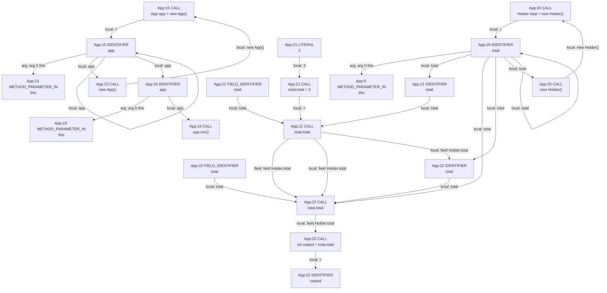

# shadowedType: spike value graph

```mermaid
flowchart TD
  n0["App:13 METHOD_PARAMETER_IN<br/>this"]
  n1["App:15 CALL<br/>App app = new App()"]
  n2["App:15 CALL<br/>new App()"]
  n3["App:15 IDENTIFIER<br/>app"]
  n4["App:16 CALL<br/>app.run()"]
  n5["App:16 IDENTIFIER<br/>app"]
  n6["App:19 METHOD_PARAMETER_IN<br/>this"]
  n7["App:20 CALL<br/>Holder total = new Holder()"]
  n8["App:20 CALL<br/>new Holder()"]
  n9["App:20 IDENTIFIER<br/>total"]
  n10["App:21 CALL<br/>total.total"]
  n11["App:21 CALL<br/>total.total = 3"]
  n12["App:21 FIELD_IDENTIFIER<br/>total"]
  n13["App:21 IDENTIFIER<br/>total"]
  n14["App:21 LITERAL<br/>3"]
  n15["App:22 CALL<br/>int copied = total.total"]
  n16["App:22 CALL<br/>total.total"]
  n17["App:22 FIELD_IDENTIFIER<br/>total"]
  n18["App:22 IDENTIFIER<br/>copied"]
  n19["App:22 IDENTIFIER<br/>total"]
  n20["App:9 METHOD_PARAMETER_IN<br/>this"]
  n1 -->|"local: ="| n3
  n10 -->|"field: field Holder.total"| n16
  n10 -->|"local: field Holder.total"| n16
  n10 -->|"local: field Holder.total"| n19
  n11 -->|"local: ="| n10
  n12 -->|"local: total"| n10
  n13 -->|"local: total"| n10
  n14 -->|"local: 3"| n11
  n15 -->|"local: ="| n18
  n16 -->|"local: field Holder.total"| n15
  n17 -->|"local: total"| n16
  n19 -->|"local: total"| n16
  n2 -->|"local: new App()"| n1
  n3 -->|"arg: arg 0 this"| n0
  n3 -->|"local: app"| n2
  n3 -->|"local: app"| n3
  n3 -->|"local: app"| n5
  n5 -->|"arg: arg 0 this"| n6
  n5 -->|"local: app"| n4
  n7 -->|"local: ="| n9
  n8 -->|"local: new Holder()"| n7
  n9 -->|"arg: arg 0 this"| n20
  n9 -->|"local: total"| n13
  n9 -->|"local: total"| n16
  n9 -->|"local: total"| n19
  n9 -->|"local: total"| n8
  n9 -->|"local: total"| n9
```
