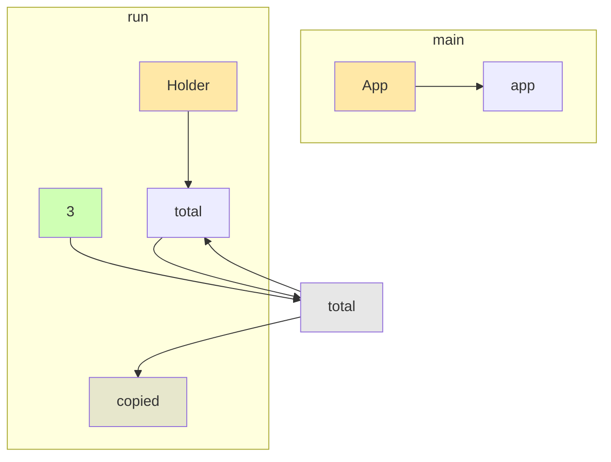

# shadowedType: spike value graph (condensed)

```mermaid
flowchart TD
  subgraph m0["main"]
    n0["App"]:::EXTERNAL
    n1["app"]:::OBJ_VARIABLE
  end
  subgraph m1["run"]
    n2["Holder"]:::EXTERNAL
    n3["3"]:::LITERAL
    n4["copied"]:::VARIABLE
    n5["total"]:::OBJ_VARIABLE
  end
  n6["total"]:::VARIABLE
  n0 --> n1
  n2 --> n5
  n3 --> n6
  n5 --> n6
  n6 --> n4
  n6 --> n5
  classDef LITERAL fill:#00FF0030
  classDef VARIABLE fill:#80808030
  classDef BIN_OP fill:#80808080
  classDef FUNC_PARAM fill:#8080FF30
  classDef RETURN fill:#FF808080
  classDef EXTERNAL fill:#FFA50040
  classDef UNMODELLED fill:#FF000030,stroke-dasharray: 4 2
```
