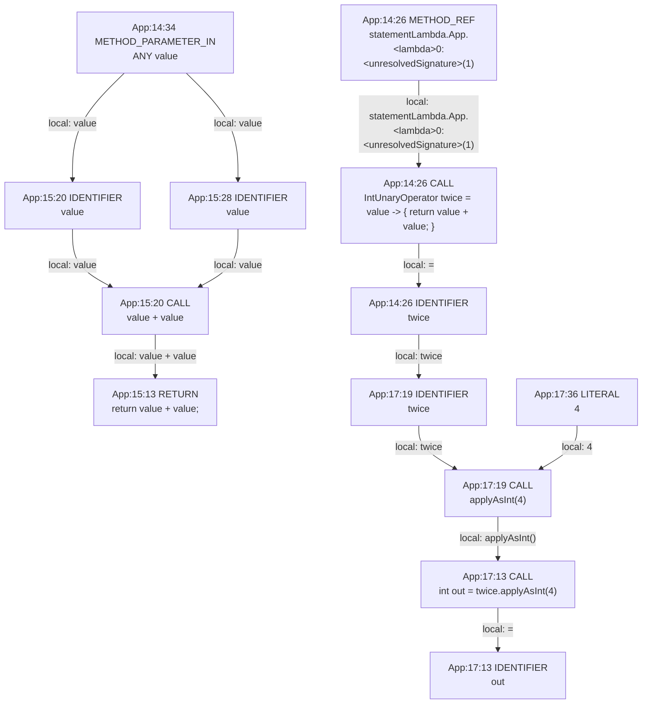

# statementLambda: spike value graph

```mermaid
flowchart TD
  n0["App:14:26 CALL<br/>IntUnaryOperator twice = value -#gt; { return value + value; }"]
  n1["App:14:26 IDENTIFIER<br/>twice"]
  n2["App:14:26 METHOD_REF<br/>statementLambda.App.#lt;lambda#gt;0:#lt;unresolvedSignature#gt;(1)"]
  n3["App:14:34 METHOD_PARAMETER_IN<br/>ANY value"]
  n4["App:15:13 RETURN<br/>return value + value;"]
  n5["App:15:20 CALL<br/>value + value"]
  n6["App:15:20 IDENTIFIER<br/>value"]
  n7["App:15:28 IDENTIFIER<br/>value"]
  n8["App:17:13 CALL<br/>int out = twice.applyAsInt(4)"]
  n9["App:17:13 IDENTIFIER<br/>out"]
  n10["App:17:19 CALL<br/>applyAsInt(4)"]
  n11["App:17:19 IDENTIFIER<br/>twice"]
  n12["App:17:36 LITERAL<br/>4"]
  n0 -->|"local: ="| n1
  n1 -->|"local: twice"| n11
  n10 -->|"local: applyAsInt()"| n8
  n11 -->|"local: twice"| n10
  n12 -->|"local: 4"| n10
  n2 -->|"local: statementLambda.App.#lt;lambda#gt;0:#lt;unresolvedSignature#gt;(1)"| n0
  n3 -->|"local: value"| n6
  n3 -->|"local: value"| n7
  n5 -->|"local: value + value"| n4
  n6 -->|"local: value"| n5
  n7 -->|"local: value"| n5
  n8 -->|"local: ="| n9
```
