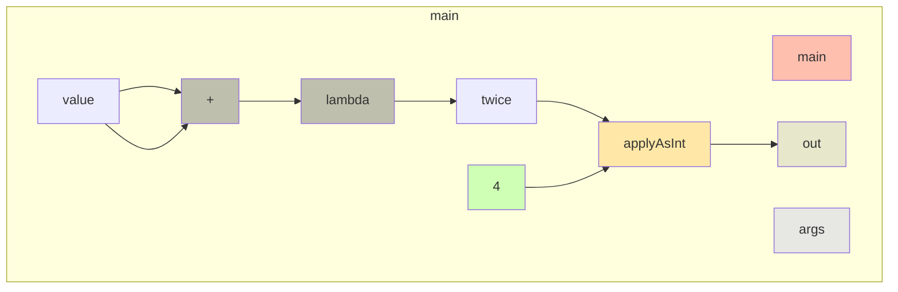

```mermaid
flowchart TD
  subgraph b0["main"]
    n1[main]:::RETURN
    n2[args]:::FUNC_PARAM
    n3[twice]:::OBJ_VARIABLE
    n4[value]:::OBJ_VARIABLE
    n5[lambda]:::BIN_OP
    n6[+]:::BIN_OP
    n7[out]:::VARIABLE
    n8[4]:::LITERAL
    n9[applyAsInt]:::EXTERNAL
    n3[twice]:::OBJ_VARIABLE --> n9[applyAsInt]:::EXTERNAL
    n4[value]:::OBJ_VARIABLE --> n6[+]:::BIN_OP
    n4[value]:::OBJ_VARIABLE --> n6[+]:::BIN_OP
    n5[lambda]:::BIN_OP --> n3[twice]:::OBJ_VARIABLE
    n6[+]:::BIN_OP --> n5[lambda]:::BIN_OP
    n8[4]:::LITERAL --> n9[applyAsInt]:::EXTERNAL
    n9[applyAsInt]:::EXTERNAL --> n7[out]:::VARIABLE
  end
  classDef LITERAL fill:#00FF0030
  classDef VARIABLE fill:#80808030
  classDef BIN_OP fill:#80808080
  classDef FUNC_PARAM fill:#8080FF30
  classDef RETURN fill:#FF808080
  classDef EXTERNAL fill:#FFA50040
```
