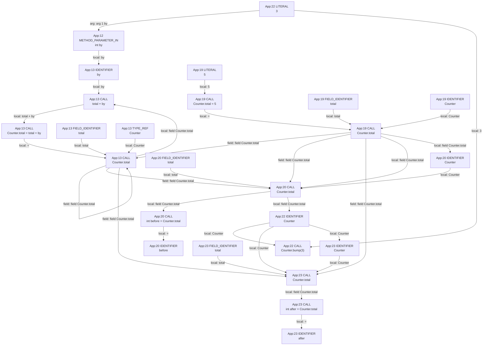

# staticField: spike value graph

```mermaid
flowchart TD
  n0["App:12 METHOD_PARAMETER_IN<br/>int by"]
  n1["App:13 CALL<br/>Counter.total"]
  n2["App:13 CALL<br/>Counter.total = total + by"]
  n3["App:13 CALL<br/>total + by"]
  n4["App:13 FIELD_IDENTIFIER<br/>total"]
  n5["App:13 IDENTIFIER<br/>by"]
  n6["App:13 TYPE_REF<br/>Counter"]
  n7["App:19 CALL<br/>Counter.total"]
  n8["App:19 CALL<br/>Counter.total = 5"]
  n9["App:19 FIELD_IDENTIFIER<br/>total"]
  n10["App:19 IDENTIFIER<br/>Counter"]
  n11["App:19 LITERAL<br/>5"]
  n12["App:20 CALL<br/>Counter.total"]
  n13["App:20 CALL<br/>int before = Counter.total"]
  n14["App:20 FIELD_IDENTIFIER<br/>total"]
  n15["App:20 IDENTIFIER<br/>Counter"]
  n16["App:20 IDENTIFIER<br/>before"]
  n17["App:22 CALL<br/>Counter.bump(3)"]
  n18["App:22 IDENTIFIER<br/>Counter"]
  n19["App:22 LITERAL<br/>3"]
  n20["App:23 CALL<br/>Counter.total"]
  n21["App:23 CALL<br/>int after = Counter.total"]
  n22["App:23 FIELD_IDENTIFIER<br/>total"]
  n23["App:23 IDENTIFIER<br/>Counter"]
  n24["App:23 IDENTIFIER<br/>after"]
  n0 -->|"local: by"| n5
  n1 -->|"field: field Counter.total"| n1
  n1 -->|"field: field Counter.total"| n12
  n1 -->|"field: field Counter.total"| n20
  n1 -->|"local: field Counter.total"| n3
  n10 -->|"local: Counter"| n7
  n11 -->|"local: 5"| n8
  n12 -->|"local: field Counter.total"| n13
  n12 -->|"local: field Counter.total"| n18
  n13 -->|"local: ="| n16
  n14 -->|"local: total"| n12
  n15 -->|"local: Counter"| n12
  n18 -->|"local: Counter"| n17
  n18 -->|"local: Counter"| n20
  n18 -->|"local: Counter"| n23
  n19 -->|"arg: arg 1 by"| n0
  n19 -->|"local: 3"| n17
  n2 -->|"local: ="| n1
  n20 -->|"local: field Counter.total"| n21
  n21 -->|"local: ="| n24
  n22 -->|"local: total"| n20
  n23 -->|"local: Counter"| n20
  n3 -->|"local: total + by"| n2
  n4 -->|"local: total"| n1
  n5 -->|"local: by"| n3
  n6 -->|"local: Counter"| n1
  n7 -->|"field: field Counter.total"| n1
  n7 -->|"field: field Counter.total"| n12
  n7 -->|"field: field Counter.total"| n20
  n7 -->|"local: field Counter.total"| n12
  n7 -->|"local: field Counter.total"| n15
  n8 -->|"local: ="| n7
  n9 -->|"local: total"| n7
```
