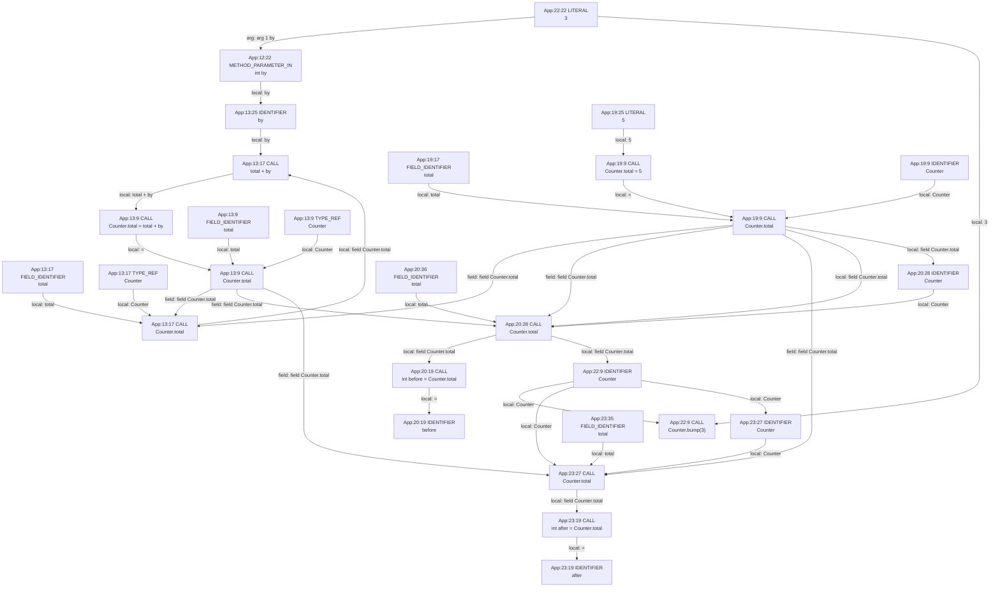

# staticField: spike value graph

```mermaid
flowchart TD
  n0["App:12:22 METHOD_PARAMETER_IN<br/>int by"]
  n1["App:13:17 CALL<br/>Counter.total"]
  n2["App:13:17 CALL<br/>total + by"]
  n3["App:13:17 FIELD_IDENTIFIER<br/>total"]
  n4["App:13:17 TYPE_REF<br/>Counter"]
  n5["App:13:25 IDENTIFIER<br/>by"]
  n6["App:13:9 CALL<br/>Counter.total"]
  n7["App:13:9 CALL<br/>Counter.total = total + by"]
  n8["App:13:9 FIELD_IDENTIFIER<br/>total"]
  n9["App:13:9 TYPE_REF<br/>Counter"]
  n10["App:19:17 FIELD_IDENTIFIER<br/>total"]
  n11["App:19:25 LITERAL<br/>5"]
  n12["App:19:9 CALL<br/>Counter.total"]
  n13["App:19:9 CALL<br/>Counter.total = 5"]
  n14["App:19:9 IDENTIFIER<br/>Counter"]
  n15["App:20:19 CALL<br/>int before = Counter.total"]
  n16["App:20:19 IDENTIFIER<br/>before"]
  n17["App:20:28 CALL<br/>Counter.total"]
  n18["App:20:28 IDENTIFIER<br/>Counter"]
  n19["App:20:36 FIELD_IDENTIFIER<br/>total"]
  n20["App:22:22 LITERAL<br/>3"]
  n21["App:22:9 CALL<br/>Counter.bump(3)"]
  n22["App:22:9 IDENTIFIER<br/>Counter"]
  n23["App:23:19 CALL<br/>int after = Counter.total"]
  n24["App:23:19 IDENTIFIER<br/>after"]
  n25["App:23:27 CALL<br/>Counter.total"]
  n26["App:23:27 IDENTIFIER<br/>Counter"]
  n27["App:23:35 FIELD_IDENTIFIER<br/>total"]
  n0 -->|"local: by"| n5
  n1 -->|"local: field Counter.total"| n2
  n10 -->|"local: total"| n12
  n11 -->|"local: 5"| n13
  n12 -->|"field: field Counter.total"| n1
  n12 -->|"field: field Counter.total"| n17
  n12 -->|"field: field Counter.total"| n25
  n12 -->|"local: field Counter.total"| n17
  n12 -->|"local: field Counter.total"| n18
  n13 -->|"local: ="| n12
  n14 -->|"local: Counter"| n12
  n15 -->|"local: ="| n16
  n17 -->|"local: field Counter.total"| n15
  n17 -->|"local: field Counter.total"| n22
  n18 -->|"local: Counter"| n17
  n19 -->|"local: total"| n17
  n2 -->|"local: total + by"| n7
  n20 -->|"arg: arg 1 by"| n0
  n20 -->|"local: 3"| n21
  n22 -->|"local: Counter"| n21
  n22 -->|"local: Counter"| n25
  n22 -->|"local: Counter"| n26
  n23 -->|"local: ="| n24
  n25 -->|"local: field Counter.total"| n23
  n26 -->|"local: Counter"| n25
  n27 -->|"local: total"| n25
  n3 -->|"local: total"| n1
  n4 -->|"local: Counter"| n1
  n5 -->|"local: by"| n2
  n6 -->|"field: field Counter.total"| n1
  n6 -->|"field: field Counter.total"| n17
  n6 -->|"field: field Counter.total"| n25
  n7 -->|"local: ="| n6
  n8 -->|"local: total"| n6
  n9 -->|"local: Counter"| n6
```
