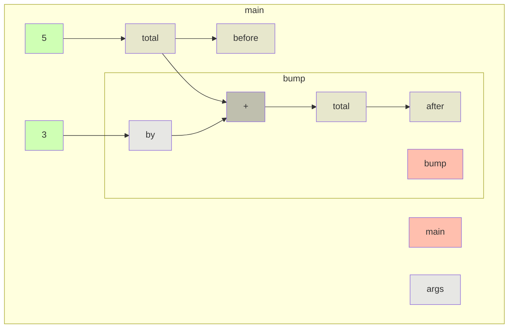

```mermaid
flowchart TD
  subgraph b0["main"]
    n1[main]:::RETURN
    n2[args]:::FUNC_PARAM
    n3[5]:::LITERAL
    n4[total]:::VARIABLE
    n5[before]:::VARIABLE
    n6[3]:::LITERAL
    n12[after]:::VARIABLE
    n3[5]:::LITERAL --> n4[total]:::VARIABLE
    n4[total]:::VARIABLE --> n5[before]:::VARIABLE
    n4[total]:::VARIABLE --> n10[+]:::BIN_OP
    n6[3]:::LITERAL --> n9[by]:::FUNC_PARAM
    subgraph b7["bump"]
      n8[bump]:::RETURN
      n9[by]:::FUNC_PARAM
      n10[+]:::BIN_OP
      n11[total]:::VARIABLE
      n9[by]:::FUNC_PARAM --> n10[+]:::BIN_OP
      n10[+]:::BIN_OP --> n11[total]:::VARIABLE
      n11[total]:::VARIABLE --> n12[after]:::VARIABLE
    end
  end
  classDef LITERAL fill:#00FF0030
  classDef VARIABLE fill:#80808030
  classDef BIN_OP fill:#80808080
  classDef FUNC_PARAM fill:#8080FF30
  classDef RETURN fill:#FF808080
  classDef EXTERNAL fill:#FFA50040
  classDef UNMODELLED fill:#FF000030,stroke-dasharray: 4 2
```
