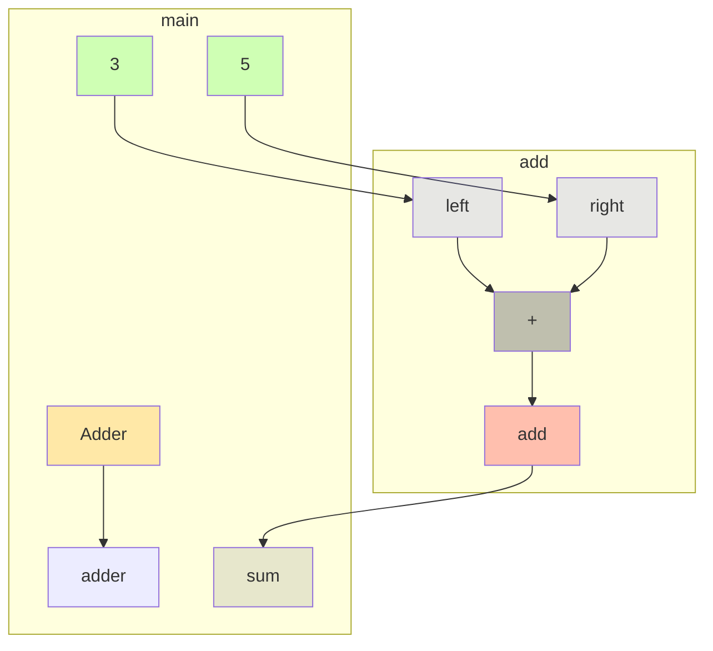

# subpackage: spike value graph (condensed)

```mermaid
flowchart TD
  subgraph m0["main"]
    n0["Adder"]:::EXTERNAL
    n1["3"]:::LITERAL
    n2["5"]:::LITERAL
    n3["adder"]:::OBJ_VARIABLE
    n4["sum"]:::VARIABLE
  end
  subgraph m1["add"]
    n5["+"]:::BIN_OP
    n6["left"]:::FUNC_PARAM
    n7["right"]:::FUNC_PARAM
    n8["add"]:::RETURN
  end
  n0 --> n3
  n1 --> n6
  n2 --> n7
  n5 --> n8
  n6 --> n5
  n7 --> n5
  n8 --> n4
  classDef LITERAL fill:#00FF0030
  classDef VARIABLE fill:#80808030
  classDef BIN_OP fill:#80808080
  classDef FUNC_PARAM fill:#8080FF30
  classDef RETURN fill:#FF808080
  classDef EXTERNAL fill:#FFA50040
  classDef UNMODELLED fill:#FF000030,stroke-dasharray: 4 2
```
