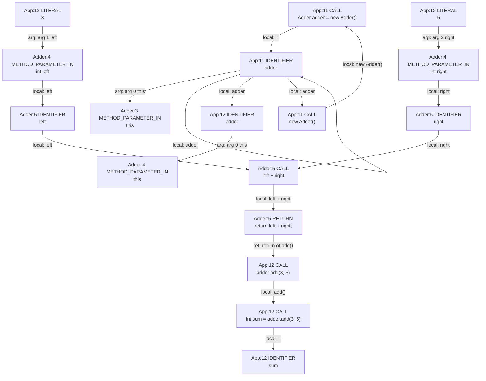

# subpackage: spike value graph

```mermaid
flowchart TD
  n0["Adder:3 METHOD_PARAMETER_IN<br/>this"]
  n1["Adder:4 METHOD_PARAMETER_IN<br/>int left"]
  n2["Adder:4 METHOD_PARAMETER_IN<br/>int right"]
  n3["Adder:4 METHOD_PARAMETER_IN<br/>this"]
  n4["Adder:5 CALL<br/>left + right"]
  n5["Adder:5 IDENTIFIER<br/>left"]
  n6["Adder:5 IDENTIFIER<br/>right"]
  n7["Adder:5 RETURN<br/>return left + right;"]
  n8["App:11 CALL<br/>Adder adder = new Adder()"]
  n9["App:11 CALL<br/>new Adder()"]
  n10["App:11 IDENTIFIER<br/>adder"]
  n11["App:12 CALL<br/>adder.add(3, 5)"]
  n12["App:12 CALL<br/>int sum = adder.add(3, 5)"]
  n13["App:12 IDENTIFIER<br/>adder"]
  n14["App:12 IDENTIFIER<br/>sum"]
  n15["App:12 LITERAL<br/>3"]
  n16["App:12 LITERAL<br/>5"]
  n1 -->|"local: left"| n5
  n10 -->|"arg: arg 0 this"| n0
  n10 -->|"local: adder"| n10
  n10 -->|"local: adder"| n13
  n10 -->|"local: adder"| n9
  n11 -->|"local: add()"| n12
  n12 -->|"local: ="| n14
  n13 -->|"arg: arg 0 this"| n3
  n15 -->|"arg: arg 1 left"| n1
  n16 -->|"arg: arg 2 right"| n2
  n2 -->|"local: right"| n6
  n4 -->|"local: left + right"| n7
  n5 -->|"local: left"| n4
  n6 -->|"local: right"| n4
  n7 -->|"ret: return of add()"| n11
  n8 -->|"local: ="| n10
  n9 -->|"local: new Adder()"| n8
```
