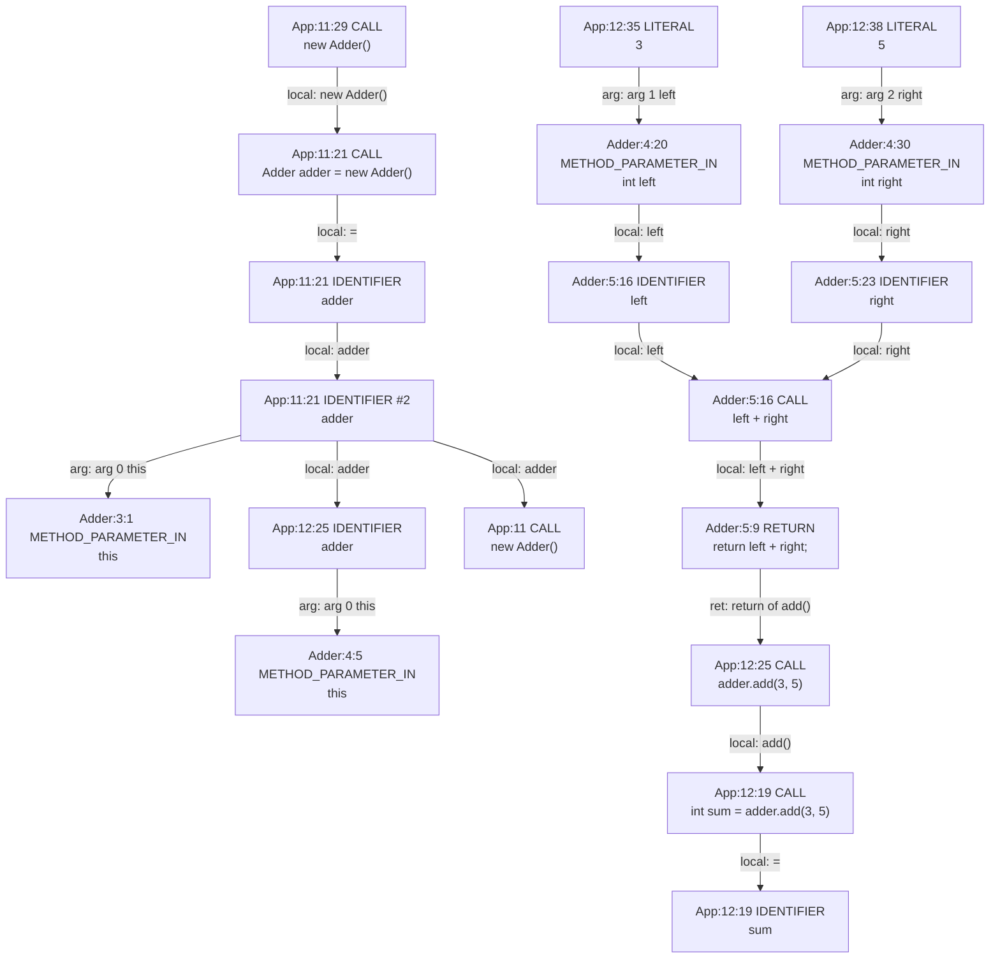

# subpackage: spike value graph

```mermaid
flowchart TD
  n0["Adder:3:1 METHOD_PARAMETER_IN<br/>this"]
  n1["Adder:4:20 METHOD_PARAMETER_IN<br/>int left"]
  n2["Adder:4:30 METHOD_PARAMETER_IN<br/>int right"]
  n3["Adder:4:5 METHOD_PARAMETER_IN<br/>this"]
  n4["Adder:5:16 CALL<br/>left + right"]
  n5["Adder:5:16 IDENTIFIER<br/>left"]
  n6["Adder:5:23 IDENTIFIER<br/>right"]
  n7["Adder:5:9 RETURN<br/>return left + right;"]
  n8["App:11 CALL<br/>new Adder()"]
  n9["App:11:21 CALL<br/>Adder adder = new Adder()"]
  n10["App:11:21 IDENTIFIER #2<br/>adder"]
  n11["App:11:21 IDENTIFIER<br/>adder"]
  n12["App:11:29 CALL<br/>new Adder()"]
  n13["App:12:19 CALL<br/>int sum = adder.add(3, 5)"]
  n14["App:12:19 IDENTIFIER<br/>sum"]
  n15["App:12:25 CALL<br/>adder.add(3, 5)"]
  n16["App:12:25 IDENTIFIER<br/>adder"]
  n17["App:12:35 LITERAL<br/>3"]
  n18["App:12:38 LITERAL<br/>5"]
  n1 -->|"local: left"| n5
  n10 -->|"arg: arg 0 this"| n0
  n10 -->|"local: adder"| n16
  n10 -->|"local: adder"| n8
  n11 -->|"local: adder"| n10
  n12 -->|"local: new Adder()"| n9
  n13 -->|"local: ="| n14
  n15 -->|"local: add()"| n13
  n16 -->|"arg: arg 0 this"| n3
  n17 -->|"arg: arg 1 left"| n1
  n18 -->|"arg: arg 2 right"| n2
  n2 -->|"local: right"| n6
  n4 -->|"local: left + right"| n7
  n5 -->|"local: left"| n4
  n6 -->|"local: right"| n4
  n7 -->|"ret: return of add()"| n15
  n9 -->|"local: ="| n11
```
