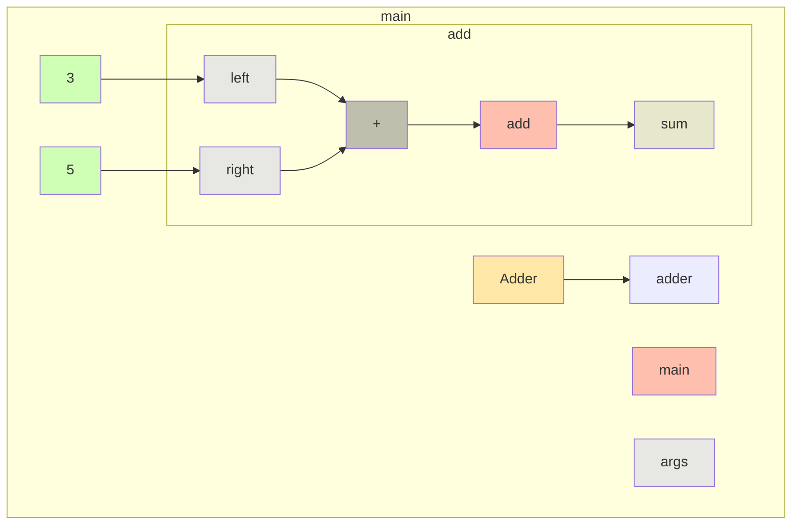

```mermaid
flowchart TD
  subgraph b0["main"]
    n1[main]:::RETURN
    n2[args]:::FUNC_PARAM
    n3[Adder]:::EXTERNAL
    n4[adder]:::OBJ_VARIABLE
    n5[3]:::LITERAL
    n6[5]:::LITERAL
    n12[sum]:::VARIABLE
    n3[Adder]:::EXTERNAL --> n4[adder]:::OBJ_VARIABLE
    n5[3]:::LITERAL --> n9[left]:::FUNC_PARAM
    n6[5]:::LITERAL --> n10[right]:::FUNC_PARAM
    subgraph b7["add"]
      n8[add]:::RETURN
      n9[left]:::FUNC_PARAM
      n10[right]:::FUNC_PARAM
      n11[+]:::BIN_OP
      n8[add]:::RETURN --> n12[sum]:::VARIABLE
      n9[left]:::FUNC_PARAM --> n11[+]:::BIN_OP
      n10[right]:::FUNC_PARAM --> n11[+]:::BIN_OP
      n11[+]:::BIN_OP --> n8[add]:::RETURN
    end
  end
  classDef LITERAL fill:#00FF0030
  classDef VARIABLE fill:#80808030
  classDef BIN_OP fill:#80808080
  classDef FUNC_PARAM fill:#8080FF30
  classDef RETURN fill:#FF808080
  classDef EXTERNAL fill:#FFA50040
```
