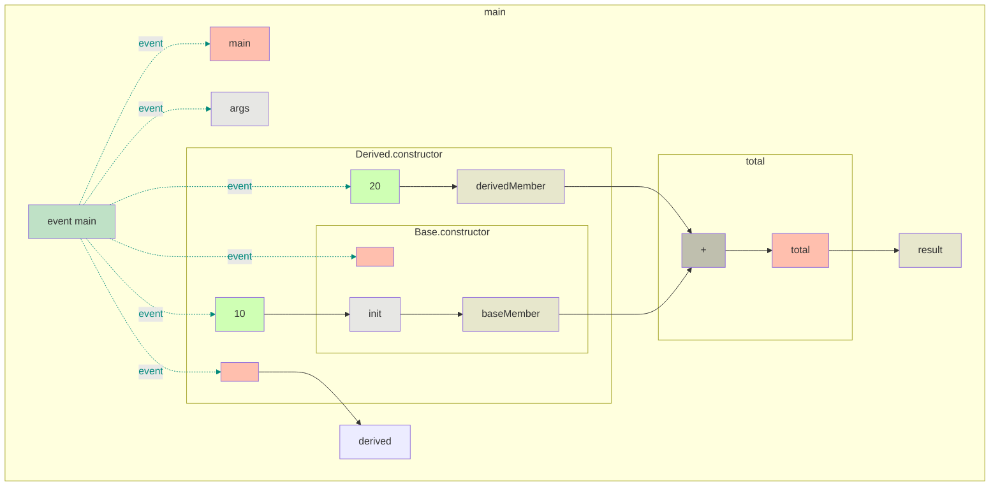

```mermaid
flowchart TD
  subgraph b0["main"]
    n1[event main]:::EVENT
    n2[main]:::RETURN
    n3[args]:::FUNC_PARAM
    n13[derived]:::OBJ_VARIABLE
    n17[result]:::VARIABLE
    n1[event main]:::EVENT -. event .-> n2[main]:::RETURN
    n1[event main]:::EVENT -. event .-> n3[args]:::FUNC_PARAM
    n1[event main]:::EVENT -. event .-> n5[<init>]:::RETURN
    n1[event main]:::EVENT -. event .-> n6[10]:::LITERAL
    n1[event main]:::EVENT -. event .-> n11[20]:::LITERAL
    n1[event main]:::EVENT -. event .-> n8[<init>]:::RETURN
    n5[<init>]:::RETURN --> n13[derived]:::OBJ_VARIABLE
    n12[derivedMember]:::VARIABLE --> n16[+]:::BIN_OP
    n10[baseMember]:::VARIABLE --> n16[+]:::BIN_OP
    n15[total]:::RETURN --> n17[result]:::VARIABLE
    subgraph b4["Derived.constructor"]
      n5[<init>]:::RETURN
      n6[10]:::LITERAL
      n11[20]:::LITERAL
      n12[derivedMember]:::VARIABLE
      n6[10]:::LITERAL --> n9[init]:::FUNC_PARAM
      n11[20]:::LITERAL --> n12[derivedMember]:::VARIABLE
      subgraph b7["Base.constructor"]
        n8[<init>]:::RETURN
        n9[init]:::FUNC_PARAM
        n10[baseMember]:::VARIABLE
        n9[init]:::FUNC_PARAM --> n10[baseMember]:::VARIABLE
      end
    end
    subgraph b14["total"]
      n15[total]:::RETURN
      n16[+]:::BIN_OP
      n16[+]:::BIN_OP --> n15[total]:::RETURN
    end
  end
  linkStyle 0 stroke:#00897b,color:#00897b
  linkStyle 1 stroke:#00897b,color:#00897b
  linkStyle 2 stroke:#00897b,color:#00897b
  linkStyle 3 stroke:#00897b,color:#00897b
  linkStyle 4 stroke:#00897b,color:#00897b
  linkStyle 5 stroke:#00897b,color:#00897b
  classDef LITERAL fill:#00FF0030
  classDef VARIABLE fill:#80808030
  classDef BIN_OP fill:#80808080
  classDef FUNC_PARAM fill:#8080FF30
  classDef RETURN fill:#FF808080
  classDef EXTERNAL fill:#FFA50040
  classDef UNMODELLED fill:#FF000030,stroke-dasharray: 4 2
  classDef EVENT fill:#00897B40
```
