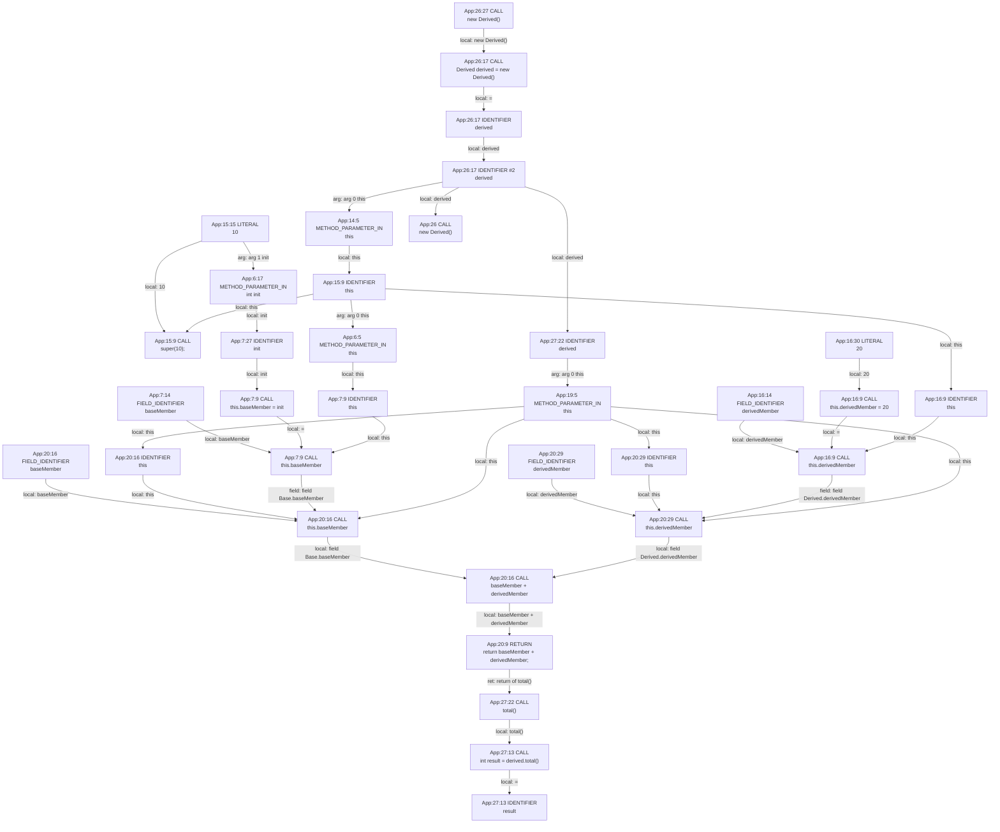

# superCall: spike value graph

```mermaid
flowchart TD
  n0["App:14:5 METHOD_PARAMETER_IN<br/>this"]
  n1["App:15:15 LITERAL<br/>10"]
  n2["App:15:9 CALL<br/>super(10);"]
  n3["App:15:9 IDENTIFIER<br/>this"]
  n4["App:16:14 FIELD_IDENTIFIER<br/>derivedMember"]
  n5["App:16:30 LITERAL<br/>20"]
  n6["App:16:9 CALL<br/>this.derivedMember"]
  n7["App:16:9 CALL<br/>this.derivedMember = 20"]
  n8["App:16:9 IDENTIFIER<br/>this"]
  n9["App:19:5 METHOD_PARAMETER_IN<br/>this"]
  n10["App:20:16 CALL<br/>baseMember + derivedMember"]
  n11["App:20:16 CALL<br/>this.baseMember"]
  n12["App:20:16 FIELD_IDENTIFIER<br/>baseMember"]
  n13["App:20:16 IDENTIFIER<br/>this"]
  n14["App:20:29 CALL<br/>this.derivedMember"]
  n15["App:20:29 FIELD_IDENTIFIER<br/>derivedMember"]
  n16["App:20:29 IDENTIFIER<br/>this"]
  n17["App:20:9 RETURN<br/>return baseMember + derivedMember;"]
  n18["App:26 CALL<br/>new Derived()"]
  n19["App:26:17 CALL<br/>Derived derived = new Derived()"]
  n20["App:26:17 IDENTIFIER #2<br/>derived"]
  n21["App:26:17 IDENTIFIER<br/>derived"]
  n22["App:26:27 CALL<br/>new Derived()"]
  n23["App:27:13 CALL<br/>int result = derived.total()"]
  n24["App:27:13 IDENTIFIER<br/>result"]
  n25["App:27:22 CALL<br/>total()"]
  n26["App:27:22 IDENTIFIER<br/>derived"]
  n27["App:6:17 METHOD_PARAMETER_IN<br/>int init"]
  n28["App:6:5 METHOD_PARAMETER_IN<br/>this"]
  n29["App:7:14 FIELD_IDENTIFIER<br/>baseMember"]
  n30["App:7:27 IDENTIFIER<br/>init"]
  n31["App:7:9 CALL<br/>this.baseMember"]
  n32["App:7:9 CALL<br/>this.baseMember = init"]
  n33["App:7:9 IDENTIFIER<br/>this"]
  n0 -->|"local: this"| n3
  n1 -->|"arg: arg 1 init"| n27
  n1 -->|"local: 10"| n2
  n10 -->|"local: baseMember + derivedMember"| n17
  n11 -->|"local: field Base.baseMember"| n10
  n12 -->|"local: baseMember"| n11
  n13 -->|"local: this"| n11
  n14 -->|"local: field Derived.derivedMember"| n10
  n15 -->|"local: derivedMember"| n14
  n16 -->|"local: this"| n14
  n17 -->|"ret: return of total()"| n25
  n19 -->|"local: ="| n21
  n20 -->|"arg: arg 0 this"| n0
  n20 -->|"local: derived"| n18
  n20 -->|"local: derived"| n26
  n21 -->|"local: derived"| n20
  n22 -->|"local: new Derived()"| n19
  n23 -->|"local: ="| n24
  n25 -->|"local: total()"| n23
  n26 -->|"arg: arg 0 this"| n9
  n27 -->|"local: init"| n30
  n28 -->|"local: this"| n33
  n29 -->|"local: baseMember"| n31
  n3 -->|"arg: arg 0 this"| n28
  n3 -->|"local: this"| n2
  n3 -->|"local: this"| n8
  n30 -->|"local: init"| n32
  n31 -->|"field: field Base.baseMember"| n11
  n32 -->|"local: ="| n31
  n33 -->|"local: this"| n31
  n4 -->|"local: derivedMember"| n6
  n5 -->|"local: 20"| n7
  n6 -->|"field: field Derived.derivedMember"| n14
  n7 -->|"local: ="| n6
  n8 -->|"local: this"| n6
  n9 -->|"local: this"| n11
  n9 -->|"local: this"| n13
  n9 -->|"local: this"| n14
  n9 -->|"local: this"| n16
```
