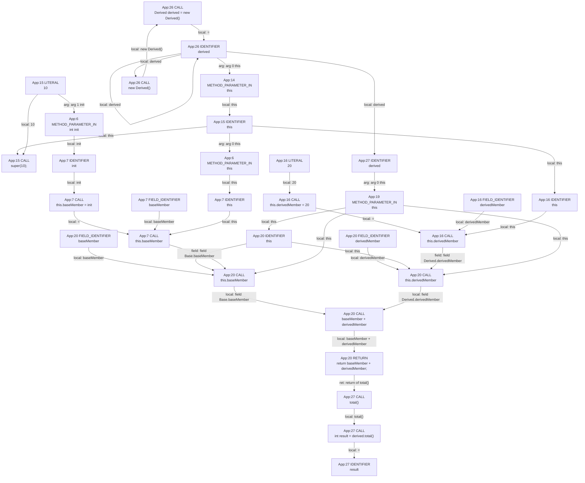

# superCall: spike value graph

```mermaid
flowchart TD
  n0["App:14 METHOD_PARAMETER_IN<br/>this"]
  n1["App:15 CALL<br/>super(10);"]
  n2["App:15 IDENTIFIER<br/>this"]
  n3["App:15 LITERAL<br/>10"]
  n4["App:16 CALL<br/>this.derivedMember"]
  n5["App:16 CALL<br/>this.derivedMember = 20"]
  n6["App:16 FIELD_IDENTIFIER<br/>derivedMember"]
  n7["App:16 IDENTIFIER<br/>this"]
  n8["App:16 LITERAL<br/>20"]
  n9["App:19 METHOD_PARAMETER_IN<br/>this"]
  n10["App:20 CALL<br/>baseMember + derivedMember"]
  n11["App:20 CALL<br/>this.baseMember"]
  n12["App:20 CALL<br/>this.derivedMember"]
  n13["App:20 FIELD_IDENTIFIER<br/>baseMember"]
  n14["App:20 FIELD_IDENTIFIER<br/>derivedMember"]
  n15["App:20 IDENTIFIER<br/>this"]
  n16["App:20 RETURN<br/>return baseMember + derivedMember;"]
  n17["App:26 CALL<br/>Derived derived = new Derived()"]
  n18["App:26 CALL<br/>new Derived()"]
  n19["App:26 IDENTIFIER<br/>derived"]
  n20["App:27 CALL<br/>int result = derived.total()"]
  n21["App:27 CALL<br/>total()"]
  n22["App:27 IDENTIFIER<br/>derived"]
  n23["App:27 IDENTIFIER<br/>result"]
  n24["App:6 METHOD_PARAMETER_IN<br/>int init"]
  n25["App:6 METHOD_PARAMETER_IN<br/>this"]
  n26["App:7 CALL<br/>this.baseMember"]
  n27["App:7 CALL<br/>this.baseMember = init"]
  n28["App:7 FIELD_IDENTIFIER<br/>baseMember"]
  n29["App:7 IDENTIFIER<br/>init"]
  n30["App:7 IDENTIFIER<br/>this"]
  n0 -->|"local: this"| n2
  n10 -->|"local: baseMember + derivedMember"| n16
  n11 -->|"local: field Base.baseMember"| n10
  n12 -->|"local: field Derived.derivedMember"| n10
  n13 -->|"local: baseMember"| n11
  n14 -->|"local: derivedMember"| n12
  n15 -->|"local: this"| n11
  n15 -->|"local: this"| n12
  n16 -->|"ret: return of total()"| n21
  n17 -->|"local: ="| n19
  n18 -->|"local: new Derived()"| n17
  n19 -->|"arg: arg 0 this"| n0
  n19 -->|"local: derived"| n18
  n19 -->|"local: derived"| n19
  n19 -->|"local: derived"| n22
  n2 -->|"arg: arg 0 this"| n25
  n2 -->|"local: this"| n1
  n2 -->|"local: this"| n7
  n20 -->|"local: ="| n23
  n21 -->|"local: total()"| n20
  n22 -->|"arg: arg 0 this"| n9
  n24 -->|"local: init"| n29
  n25 -->|"local: this"| n30
  n26 -->|"field: field Base.baseMember"| n11
  n27 -->|"local: ="| n26
  n28 -->|"local: baseMember"| n26
  n29 -->|"local: init"| n27
  n3 -->|"arg: arg 1 init"| n24
  n3 -->|"local: 10"| n1
  n30 -->|"local: this"| n26
  n4 -->|"field: field Derived.derivedMember"| n12
  n5 -->|"local: ="| n4
  n6 -->|"local: derivedMember"| n4
  n7 -->|"local: this"| n4
  n8 -->|"local: 20"| n5
  n9 -->|"local: this"| n11
  n9 -->|"local: this"| n12
  n9 -->|"local: this"| n15
```
