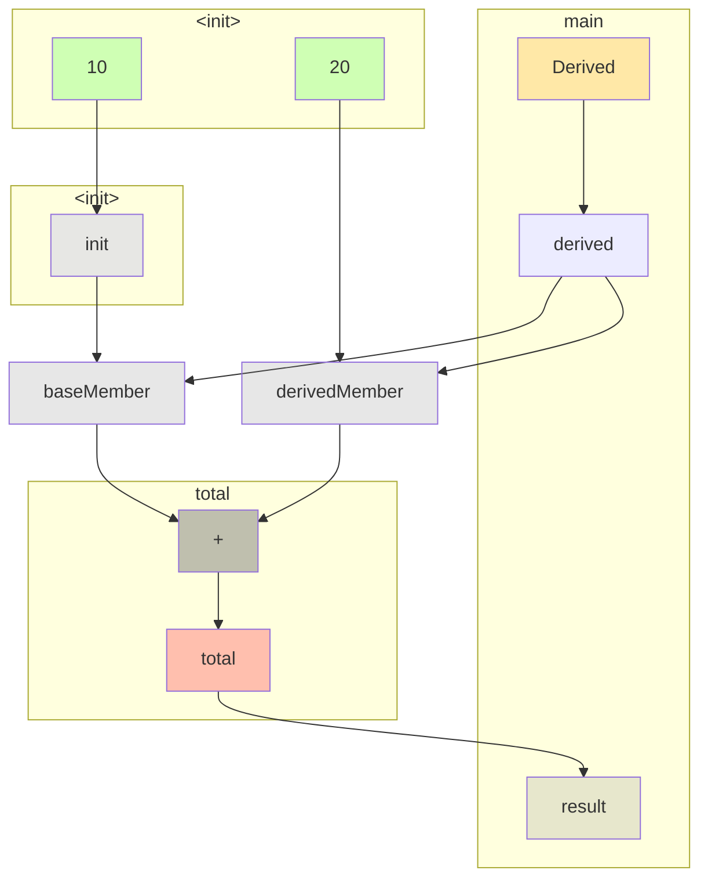

# superCall: spike value graph (condensed)

```mermaid
flowchart TD
  subgraph m0["main"]
    n0["Derived"]:::EXTERNAL
    n1["derived"]:::OBJ_VARIABLE
    n2["result"]:::VARIABLE
  end
  subgraph m1["#lt;init#gt;"]
    n3["init"]:::FUNC_PARAM
  end
  subgraph m2["#lt;init#gt;"]
    n4["10"]:::LITERAL
    n5["20"]:::LITERAL
  end
  subgraph m3["total"]
    n6["+"]:::BIN_OP
    n7["total"]:::RETURN
  end
  n8["baseMember"]:::VARIABLE
  n9["derivedMember"]:::VARIABLE
  n0 --> n1
  n1 --> n8
  n1 --> n9
  n3 --> n8
  n4 --> n3
  n5 --> n9
  n6 --> n7
  n7 --> n2
  n8 --> n6
  n9 --> n6
  classDef LITERAL fill:#00FF0030
  classDef VARIABLE fill:#80808030
  classDef BIN_OP fill:#80808080
  classDef FUNC_PARAM fill:#8080FF30
  classDef RETURN fill:#FF808080
  classDef EXTERNAL fill:#FFA50040
  classDef UNMODELLED fill:#FF000030,stroke-dasharray: 4 2
```
