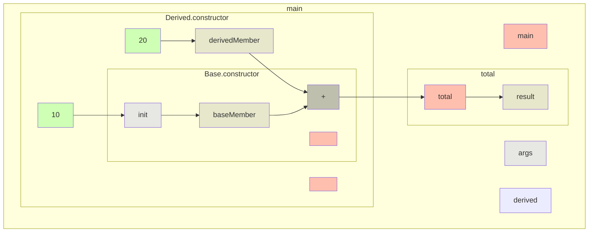

```mermaid
flowchart TD
  subgraph 4309014["main"]
    -14832420939[result]:::VARIABLE
    56853577[main]:::RETURN
    1103816169[args]:::FUNC_PARAM
    27506959672[derived]:::OBJ_VARIABLE
    subgraph 304022937["Derived.constructor"]
      -669454069[10]:::LITERAL
      -669453424[20]:::LITERAL
      17795998222[derivedMember]:::VARIABLE
      31960536857[<init>]:::RETURN
      -669454069[10]:::LITERAL --> 1502393740[init]:::FUNC_PARAM
      -669453424[20]:::LITERAL --> 17795998222[derivedMember]:::VARIABLE
      17795998222[derivedMember]:::VARIABLE --> -669476634[+]:::BIN_OP
      subgraph 1002994852["Base.constructor"]
        -17729473935[baseMember]:::VARIABLE
        1502393740[init]:::FUNC_PARAM
        30238225032[<init>]:::RETURN
        -17729473935[baseMember]:::VARIABLE --> -669476634[+]:::BIN_OP
        1502393740[init]:::FUNC_PARAM --> -17729473935[baseMember]:::VARIABLE
      end
    end
    subgraph 304026600["total"]
      -669476634[+]:::BIN_OP
      2932178286[total]:::RETURN
      -669476634[+]:::BIN_OP --> 2932178286[total]:::RETURN
      2932178286[total]:::RETURN --> -14832420939[result]:::VARIABLE
    end
  end
  classDef LITERAL fill:#00FF0030
  classDef VARIABLE fill:#80808030
  classDef BIN_OP fill:#80808080
  classDef FUNC_PARAM fill:#8080FF30
  classDef RETURN fill:#FF808080
```
