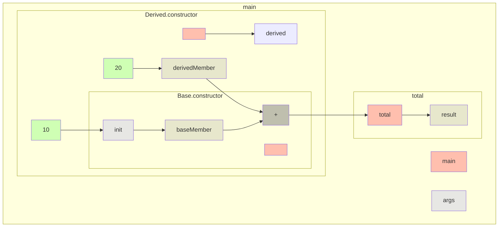

```mermaid
flowchart TD
  subgraph b0["main"]
    n1[main]:::RETURN
    n2[args]:::FUNC_PARAM
    n12[derived]:::OBJ_VARIABLE
    n16[result]:::VARIABLE
    subgraph b3["Derived.constructor"]
      n4[<init>]:::RETURN
      n8[10]:::LITERAL
      n10[20]:::LITERAL
      n11[derivedMember]:::VARIABLE
      n4[<init>]:::RETURN --> n12[derived]:::OBJ_VARIABLE
      n8[10]:::LITERAL --> n7[init]:::FUNC_PARAM
      n10[20]:::LITERAL --> n11[derivedMember]:::VARIABLE
      n11[derivedMember]:::VARIABLE --> n15[+]:::BIN_OP
      subgraph b5["Base.constructor"]
        n6[<init>]:::RETURN
        n7[init]:::FUNC_PARAM
        n9[baseMember]:::VARIABLE
        n7[init]:::FUNC_PARAM --> n9[baseMember]:::VARIABLE
        n9[baseMember]:::VARIABLE --> n15[+]:::BIN_OP
      end
    end
    subgraph b13["total"]
      n14[total]:::RETURN
      n15[+]:::BIN_OP
      n14[total]:::RETURN --> n16[result]:::VARIABLE
      n15[+]:::BIN_OP --> n14[total]:::RETURN
    end
  end
  classDef LITERAL fill:#00FF0030
  classDef VARIABLE fill:#80808030
  classDef BIN_OP fill:#80808080
  classDef FUNC_PARAM fill:#8080FF30
  classDef RETURN fill:#FF808080
  classDef EXTERNAL fill:#FFA50040
  classDef UNMODELLED fill:#FF000030,stroke-dasharray: 4 2
```
