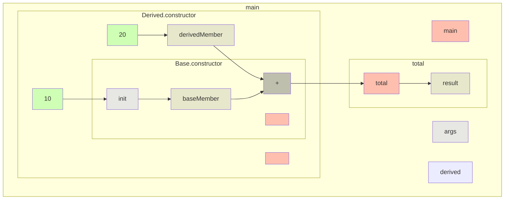

```mermaid
flowchart TD
  subgraph 4309014["main"]
    -17794003978[result]:::VARIABLE
    -1857827291[args]:::FUNC_PARAM
    56853577[main]:::RETURN
    24545323222[derived]:::OBJ_VARIABLE
    subgraph -1901390193["Derived.constructor"]
      -766858752[10]:::LITERAL
      -766827506[20]:::LITERAL
      14834387532[derivedMember]:::VARIABLE
      28998926167[<init>]:::RETURN
      -766858752[10]:::LITERAL --> 326944729[init]:::FUNC_PARAM
      -766827506[20]:::LITERAL --> 14834387532[derivedMember]:::VARIABLE
      14834387532[derivedMember]:::VARIABLE --> -765818948[+]:::BIN_OP
      subgraph 1693920094["Base.constructor"]
        -17826880477[baseMember]:::VARIABLE
        326944729[init]:::FUNC_PARAM
        30140818490[<init>]:::RETURN
        -17826880477[baseMember]:::VARIABLE --> -765818948[+]:::BIN_OP
        326944729[init]:::FUNC_PARAM --> -17826880477[baseMember]:::VARIABLE
      end
    end
    subgraph -1900222399["total"]
      -765818948[+]:::BIN_OP
      -29400941[total]:::RETURN
      -765818948[+]:::BIN_OP --> -29400941[total]:::RETURN
      -29400941[total]:::RETURN --> -17794003978[result]:::VARIABLE
    end
  end
  classDef LITERAL fill:#00FF0030
  classDef VARIABLE fill:#80808030
  classDef BIN_OP fill:#80808080
  classDef FUNC_PARAM fill:#8080FF30
  classDef RETURN fill:#FF808080
```
