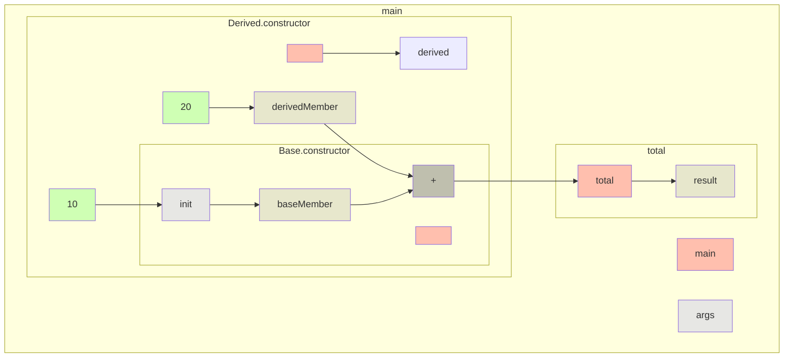

```mermaid
flowchart TD
  subgraph b0["main"]
    n1[main]:::RETURN
    n2[args]:::FUNC_PARAM
    n3[derived]:::OBJ_VARIABLE
    n13[result]:::VARIABLE
    subgraph b4["Derived.constructor"]
      n5[<init>]:::RETURN
      n9[10]:::LITERAL
      n11[derivedMember]:::VARIABLE
      n12[20]:::LITERAL
      n5[<init>]:::RETURN --> n3[derived]:::OBJ_VARIABLE
      n9[10]:::LITERAL --> n8[init]:::FUNC_PARAM
      n11[derivedMember]:::VARIABLE --> n16[+]:::BIN_OP
      n12[20]:::LITERAL --> n11[derivedMember]:::VARIABLE
      subgraph b6["Base.constructor"]
        n7[<init>]:::RETURN
        n8[init]:::FUNC_PARAM
        n10[baseMember]:::VARIABLE
        n8[init]:::FUNC_PARAM --> n10[baseMember]:::VARIABLE
        n10[baseMember]:::VARIABLE --> n16[+]:::BIN_OP
      end
    end
    subgraph b14["total"]
      n15[total]:::RETURN
      n16[+]:::BIN_OP
      n15[total]:::RETURN --> n13[result]:::VARIABLE
      n16[+]:::BIN_OP --> n15[total]:::RETURN
    end
  end
  classDef LITERAL fill:#00FF0030
  classDef VARIABLE fill:#80808030
  classDef BIN_OP fill:#80808080
  classDef FUNC_PARAM fill:#8080FF30
  classDef RETURN fill:#FF808080
  classDef EXTERNAL fill:#FFA50040
```
