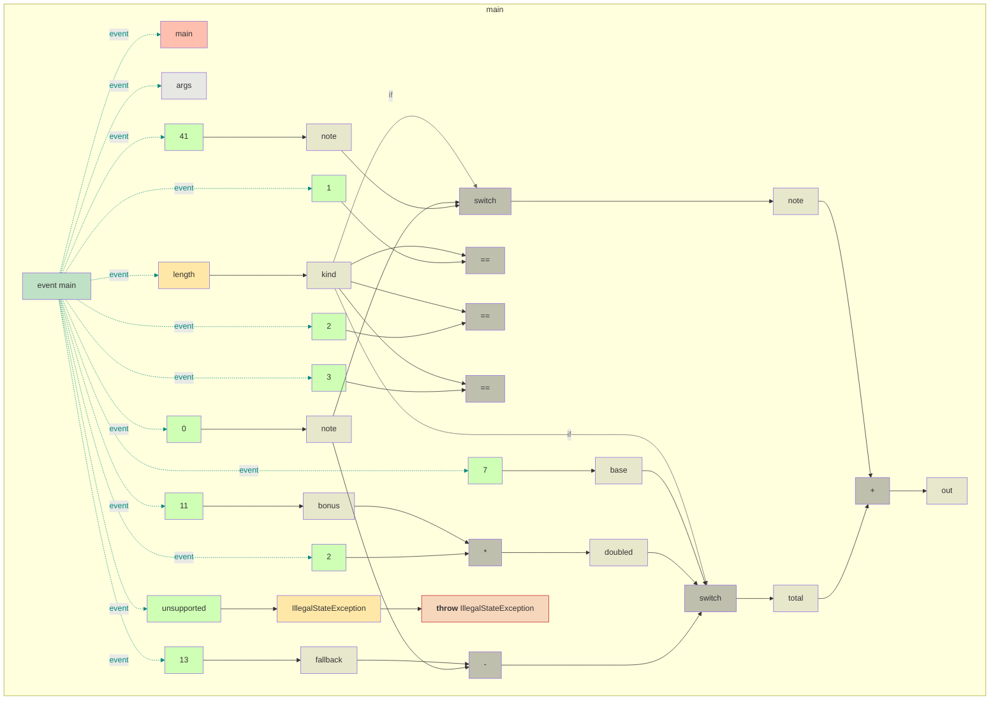

```mermaid
flowchart TD
  subgraph b0["main"]
    n1[event main]:::EVENT
    n2[main]:::RETURN
    n3[args]:::FUNC_PARAM
    n4[length]:::EXTERNAL
    n5[kind]:::VARIABLE
    n6[7]:::LITERAL
    n7[base]:::VARIABLE
    n8[11]:::LITERAL
    n9[bonus]:::VARIABLE
    n10[13]:::LITERAL
    n11[fallback]:::VARIABLE
    n12[0]:::LITERAL
    n13[note]:::VARIABLE
    n14[1]:::LITERAL
    n15[==]:::BIN_OP
    n16[2]:::LITERAL
    n17[==]:::BIN_OP
    n18[41]:::LITERAL
    n19[note]:::VARIABLE
    n20[2]:::LITERAL
    n21[*]:::BIN_OP
    n22[doubled]:::VARIABLE
    n23[3]:::LITERAL
    n24[==]:::BIN_OP
    n25[-]:::BIN_OP
    n26["unsupported"]:::LITERAL
    n27[IllegalStateException]:::EXTERNAL
    n28["`**throw** IllegalStateException`"]:::THROW
    n29[switch]:::BIN_OP
    n30[note]:::VARIABLE
    n31[switch]:::BIN_OP
    n32[total]:::VARIABLE
    n33[+]:::BIN_OP
    n34[out]:::VARIABLE
    n1[event main]:::EVENT -. event .-> n2[main]:::RETURN
    n1[event main]:::EVENT -. event .-> n3[args]:::FUNC_PARAM
    n1[event main]:::EVENT -. event .-> n4[length]:::EXTERNAL
    n1[event main]:::EVENT -. event .-> n6[7]:::LITERAL
    n1[event main]:::EVENT -. event .-> n8[11]:::LITERAL
    n1[event main]:::EVENT -. event .-> n10[13]:::LITERAL
    n1[event main]:::EVENT -. event .-> n12[0]:::LITERAL
    n1[event main]:::EVENT -. event .-> n14[1]:::LITERAL
    n1[event main]:::EVENT -. event .-> n16[2]:::LITERAL
    n1[event main]:::EVENT -. event .-> n18[41]:::LITERAL
    n1[event main]:::EVENT -. event .-> n20[2]:::LITERAL
    n1[event main]:::EVENT -. event .-> n23[3]:::LITERAL
    n1[event main]:::EVENT -. event .-> n26["unsupported"]:::LITERAL
    n4[length]:::EXTERNAL --> n5[kind]:::VARIABLE
    n5[kind]:::VARIABLE --> n15[==]:::BIN_OP
    n5[kind]:::VARIABLE --> n17[==]:::BIN_OP
    n5[kind]:::VARIABLE --> n24[==]:::BIN_OP
    n5[kind]:::VARIABLE -->|if| n29[switch]:::BIN_OP
    n5[kind]:::VARIABLE -->|if| n31[switch]:::BIN_OP
    n6[7]:::LITERAL --> n7[base]:::VARIABLE
    n7[base]:::VARIABLE --> n31[switch]:::BIN_OP
    n8[11]:::LITERAL --> n9[bonus]:::VARIABLE
    n9[bonus]:::VARIABLE --> n21[*]:::BIN_OP
    n10[13]:::LITERAL --> n11[fallback]:::VARIABLE
    n11[fallback]:::VARIABLE --> n25[-]:::BIN_OP
    n12[0]:::LITERAL --> n13[note]:::VARIABLE
    n13[note]:::VARIABLE --> n25[-]:::BIN_OP
    n13[note]:::VARIABLE --> n29[switch]:::BIN_OP
    n14[1]:::LITERAL --> n15[==]:::BIN_OP
    n16[2]:::LITERAL --> n17[==]:::BIN_OP
    n18[41]:::LITERAL --> n19[note]:::VARIABLE
    n19[note]:::VARIABLE --> n29[switch]:::BIN_OP
    n20[2]:::LITERAL --> n21[*]:::BIN_OP
    n21[*]:::BIN_OP --> n22[doubled]:::VARIABLE
    n22[doubled]:::VARIABLE --> n31[switch]:::BIN_OP
    n23[3]:::LITERAL --> n24[==]:::BIN_OP
    n25[-]:::BIN_OP --> n31[switch]:::BIN_OP
    n26["unsupported"]:::LITERAL --> n27[IllegalStateException]:::EXTERNAL
    n27[IllegalStateException]:::EXTERNAL --> n28["`**throw** IllegalStateException`"]:::THROW
    n29[switch]:::BIN_OP --> n30[note]:::VARIABLE
    n30[note]:::VARIABLE --> n33[+]:::BIN_OP
    n31[switch]:::BIN_OP --> n32[total]:::VARIABLE
    n32[total]:::VARIABLE --> n33[+]:::BIN_OP
    n33[+]:::BIN_OP --> n34[out]:::VARIABLE
  end
  linkStyle 0 stroke:#00897b,color:#00897b
  linkStyle 1 stroke:#00897b,color:#00897b
  linkStyle 2 stroke:#00897b,color:#00897b
  linkStyle 3 stroke:#00897b,color:#00897b
  linkStyle 4 stroke:#00897b,color:#00897b
  linkStyle 5 stroke:#00897b,color:#00897b
  linkStyle 6 stroke:#00897b,color:#00897b
  linkStyle 7 stroke:#00897b,color:#00897b
  linkStyle 8 stroke:#00897b,color:#00897b
  linkStyle 9 stroke:#00897b,color:#00897b
  linkStyle 10 stroke:#00897b,color:#00897b
  linkStyle 11 stroke:#00897b,color:#00897b
  linkStyle 12 stroke:#00897b,color:#00897b
  linkStyle 17 stroke:#6a6a6a,color:#6a6a6a
  linkStyle 18 stroke:#6a6a6a,color:#6a6a6a
  classDef LITERAL fill:#00FF0030
  classDef VARIABLE fill:#80808030
  classDef BIN_OP fill:#80808080
  classDef FUNC_PARAM fill:#8080FF30
  classDef RETURN fill:#FF808080
  classDef EXTERNAL fill:#FFA50040
  classDef UNMODELLED fill:#FF000030,stroke-dasharray: 4 2
  classDef EVENT fill:#00897B40
  classDef THROW fill:#D32F2F30,stroke:#C62828
```
