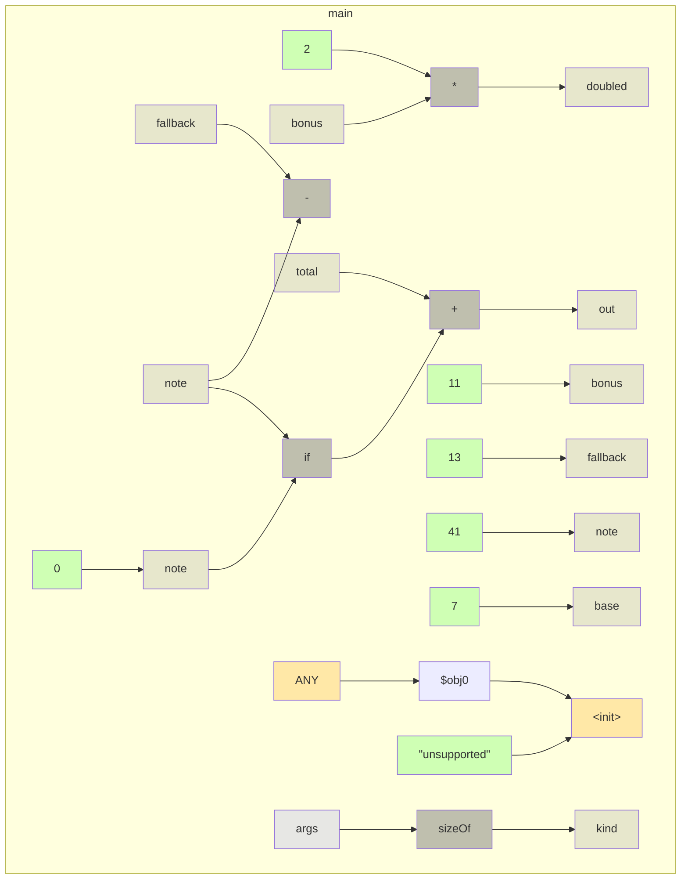

# switchExpression: spike value graph (condensed)

```mermaid
flowchart TD
  subgraph m0["main"]
    n0["*"]:::BIN_OP
    n1["+"]:::BIN_OP
    n2["-"]:::BIN_OP
    n3["sizeOf"]:::BIN_OP
    n4["#lt;init#gt;"]:::EXTERNAL
    n5["ANY"]:::EXTERNAL
    n6["args"]:::FUNC_PARAM
    n7["if"]:::BIN_OP
    n8["#quot;unsupported#quot;"]:::LITERAL
    n9["0"]:::LITERAL
    n10["11"]:::LITERAL
    n11["13"]:::LITERAL
    n12["2"]:::LITERAL
    n13["41"]:::LITERAL
    n14["7"]:::LITERAL
    n15["$obj0"]:::OBJ_VARIABLE
    n16["base"]:::VARIABLE
    n17["bonus"]:::VARIABLE
    n18["bonus"]:::VARIABLE
    n19["doubled"]:::VARIABLE
    n20["fallback"]:::VARIABLE
    n21["fallback"]:::VARIABLE
    n22["kind"]:::VARIABLE
    n23["note"]:::VARIABLE
    n24["note"]:::VARIABLE
    n25["note"]:::VARIABLE
    n26["out"]:::VARIABLE
    n27["total"]:::VARIABLE
  end
  n0 --> n19
  n1 --> n26
  n10 --> n18
  n11 --> n21
  n12 --> n0
  n13 --> n25
  n14 --> n16
  n15 --> n4
  n17 --> n0
  n20 --> n2
  n23 --> n2
  n23 --> n7
  n24 --> n7
  n27 --> n1
  n3 --> n22
  n5 --> n15
  n6 --> n3
  n7 --> n1
  n8 --> n4
  n9 --> n24
  classDef LITERAL fill:#00FF0030
  classDef VARIABLE fill:#80808030
  classDef BIN_OP fill:#80808080
  classDef FUNC_PARAM fill:#8080FF30
  classDef RETURN fill:#FF808080
  classDef EXTERNAL fill:#FFA50040
  classDef UNMODELLED fill:#FF000030,stroke-dasharray: 4 2
```
