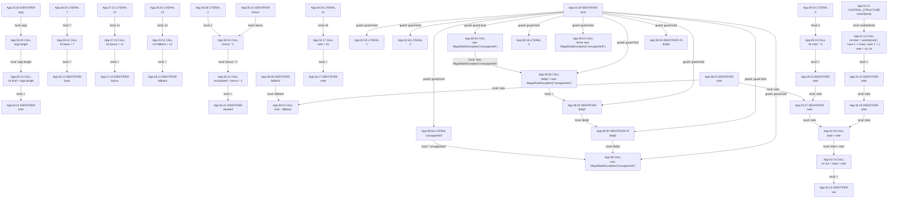

# switchExpression: spike value graph

```mermaid
flowchart TD
  n0["App:25:13 CALL<br/>int kind = args.length"]
  n1["App:25:13 IDENTIFIER<br/>kind"]
  n2["App:25:20 CALL<br/>args.length"]
  n3["App:25:20 IDENTIFIER<br/>args"]
  n4["App:26:13 CALL<br/>int base = 7"]
  n5["App:26:13 IDENTIFIER<br/>base"]
  n6["App:26:20 LITERAL<br/>7"]
  n7["App:27:13 CALL<br/>int bonus = 11"]
  n8["App:27:13 IDENTIFIER<br/>bonus"]
  n9["App:27:21 LITERAL<br/>11"]
  n10["App:28:13 CALL<br/>int fallback = 13"]
  n11["App:28:13 IDENTIFIER<br/>fallback"]
  n12["App:28:24 LITERAL<br/>13"]
  n13["App:29:13 CALL<br/>int note = 0"]
  n14["App:29:13 IDENTIFIER<br/>note"]
  n15["App:29:20 LITERAL<br/>0"]
  n16["App:31:13 CALL<br/>int total = switch(kind) { case 1 -#gt; base; case 2 -#gt; { note = 41; int "]
  n17["App:31:13 IDENTIFIER<br/>total"]
  n18["App:31:21 CONTROL_STRUCTURE<br/>switch(kind)"]
  n19["App:31:29 IDENTIFIER<br/>kind"]
  n20["App:32:18 LITERAL<br/>1"]
  n21["App:33:18 LITERAL<br/>2"]
  n22["App:34:17 CALL<br/>note = 41"]
  n23["App:34:17 IDENTIFIER<br/>note"]
  n24["App:34:24 LITERAL<br/>41"]
  n25["App:35:21 CALL<br/>int doubled = bonus * 2"]
  n26["App:35:21 IDENTIFIER<br/>doubled"]
  n27["App:35:31 CALL<br/>bonus * 2"]
  n28["App:35:31 IDENTIFIER<br/>bonus"]
  n29["App:35:39 LITERAL<br/>2"]
  n30["App:38:18 LITERAL<br/>3"]
  n31["App:38:23 CALL<br/>note - fallback"]
  n32["App:38:23 IDENTIFIER<br/>note"]
  n33["App:38:30 IDENTIFIER<br/>fallback"]
  n34["App:39 CALL<br/>new IllegalStateException(#quot;unsupported#quot;)"]
  n35["App:39:24 CALL<br/>throw new IllegalStateException(#quot;unsupported#quot;);"]
  n36["App:39:30 CALL<br/>$obj0 = new IllegalStateException(#quot;unsupported#quot;)"]
  n37["App:39:30 CALL<br/>new IllegalStateException(#quot;unsupported#quot;)"]
  n38["App:39:30 IDENTIFIER #2<br/>$obj0"]
  n39["App:39:30 IDENTIFIER #3<br/>$obj0"]
  n40["App:39:30 IDENTIFIER<br/>$obj0"]
  n41["App:39:56 LITERAL<br/>#quot;unsupported#quot;"]
  n42["App:42:13 CALL<br/>int out = total + note"]
  n43["App:42:13 IDENTIFIER<br/>out"]
  n44["App:42:19 CALL<br/>total + note"]
  n45["App:42:19 IDENTIFIER<br/>total"]
  n46["App:42:27 IDENTIFIER<br/>note"]
  n0 -->|"local: ="| n1
  n10 -->|"local: ="| n11
  n12 -->|"local: 13"| n10
  n13 -->|"local: ="| n14
  n14 -->|"local: note"| n46
  n15 -->|"local: 0"| n13
  n16 -->|"local: ="| n17
  n17 -->|"local: total"| n45
  n18 -->|"local: switch(kind)"| n16
  n19 -->|"guard: guard kind"| n20
  n19 -->|"guard: guard kind"| n21
  n19 -->|"guard: guard kind"| n30
  n19 -->|"guard: guard kind"| n34
  n19 -->|"guard: guard kind"| n35
  n19 -->|"guard: guard kind"| n36
  n19 -->|"guard: guard kind"| n37
  n19 -->|"guard: guard kind"| n38
  n19 -->|"guard: guard kind"| n39
  n19 -->|"guard: guard kind"| n40
  n19 -->|"guard: guard kind"| n41
  n2 -->|"local: args.length"| n0
  n22 -->|"local: ="| n23
  n24 -->|"local: 41"| n22
  n25 -->|"local: ="| n26
  n27 -->|"local: bonus * 2"| n25
  n28 -->|"local: bonus"| n27
  n29 -->|"local: 2"| n27
  n3 -->|"local: args"| n2
  n32 -->|"local: note"| n31
  n32 -->|"local: note"| n46
  n33 -->|"local: fallback"| n31
  n36 -->|"local: ="| n40
  n37 -->|"local: new IllegalStateException(#quot;unsupported#quot;)"| n36
  n38 -->|"local: $obj0"| n34
  n4 -->|"local: ="| n5
  n40 -->|"local: $obj0"| n38
  n41 -->|"local: #quot;unsupported#quot;"| n34
  n42 -->|"local: ="| n43
  n44 -->|"local: total + note"| n42
  n45 -->|"local: total"| n44
  n46 -->|"local: note"| n44
  n6 -->|"local: 7"| n4
  n7 -->|"local: ="| n8
  n9 -->|"local: 11"| n7
```
