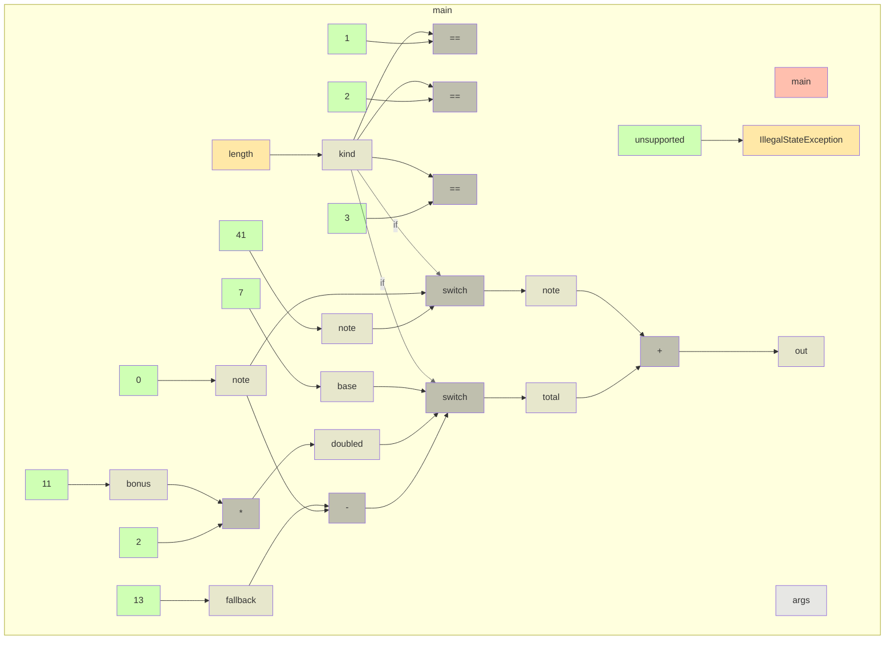

```mermaid
flowchart TD
  subgraph b0["main"]
    n1[main]:::RETURN
    n2[args]:::FUNC_PARAM
    n3[length]:::EXTERNAL
    n4[kind]:::VARIABLE
    n5[7]:::LITERAL
    n6[base]:::VARIABLE
    n7[11]:::LITERAL
    n8[bonus]:::VARIABLE
    n9[13]:::LITERAL
    n10[fallback]:::VARIABLE
    n11[0]:::LITERAL
    n12[note]:::VARIABLE
    n13[1]:::LITERAL
    n14[==]:::BIN_OP
    n15[2]:::LITERAL
    n16[==]:::BIN_OP
    n17[41]:::LITERAL
    n18[note]:::VARIABLE
    n19[2]:::LITERAL
    n20[*]:::BIN_OP
    n21[doubled]:::VARIABLE
    n22[3]:::LITERAL
    n23[==]:::BIN_OP
    n24[-]:::BIN_OP
    n25["unsupported"]:::LITERAL
    n26[IllegalStateException]:::EXTERNAL
    n27[switch]:::BIN_OP
    n28[note]:::VARIABLE
    n29[switch]:::BIN_OP
    n30[total]:::VARIABLE
    n31[+]:::BIN_OP
    n32[out]:::VARIABLE
    n3[length]:::EXTERNAL --> n4[kind]:::VARIABLE
    n4[kind]:::VARIABLE --> n14[==]:::BIN_OP
    n4[kind]:::VARIABLE --> n16[==]:::BIN_OP
    n4[kind]:::VARIABLE --> n23[==]:::BIN_OP
    n4[kind]:::VARIABLE -->|if| n27[switch]:::BIN_OP
    n4[kind]:::VARIABLE -->|if| n29[switch]:::BIN_OP
    n5[7]:::LITERAL --> n6[base]:::VARIABLE
    n6[base]:::VARIABLE --> n29[switch]:::BIN_OP
    n7[11]:::LITERAL --> n8[bonus]:::VARIABLE
    n8[bonus]:::VARIABLE --> n20[*]:::BIN_OP
    n9[13]:::LITERAL --> n10[fallback]:::VARIABLE
    n10[fallback]:::VARIABLE --> n24[-]:::BIN_OP
    n11[0]:::LITERAL --> n12[note]:::VARIABLE
    n12[note]:::VARIABLE --> n24[-]:::BIN_OP
    n12[note]:::VARIABLE --> n27[switch]:::BIN_OP
    n13[1]:::LITERAL --> n14[==]:::BIN_OP
    n15[2]:::LITERAL --> n16[==]:::BIN_OP
    n17[41]:::LITERAL --> n18[note]:::VARIABLE
    n18[note]:::VARIABLE --> n27[switch]:::BIN_OP
    n19[2]:::LITERAL --> n20[*]:::BIN_OP
    n20[*]:::BIN_OP --> n21[doubled]:::VARIABLE
    n21[doubled]:::VARIABLE --> n29[switch]:::BIN_OP
    n22[3]:::LITERAL --> n23[==]:::BIN_OP
    n24[-]:::BIN_OP --> n29[switch]:::BIN_OP
    n25["unsupported"]:::LITERAL --> n26[IllegalStateException]:::EXTERNAL
    n27[switch]:::BIN_OP --> n28[note]:::VARIABLE
    n28[note]:::VARIABLE --> n31[+]:::BIN_OP
    n29[switch]:::BIN_OP --> n30[total]:::VARIABLE
    n30[total]:::VARIABLE --> n31[+]:::BIN_OP
    n31[+]:::BIN_OP --> n32[out]:::VARIABLE
  end
  linkStyle 4 stroke:#6a6a6a,color:#6a6a6a
  linkStyle 5 stroke:#6a6a6a,color:#6a6a6a
  classDef LITERAL fill:#00FF0030
  classDef VARIABLE fill:#80808030
  classDef BIN_OP fill:#80808080
  classDef FUNC_PARAM fill:#8080FF30
  classDef RETURN fill:#FF808080
  classDef EXTERNAL fill:#FFA50040
  classDef UNMODELLED fill:#FF000030,stroke-dasharray: 4 2
```
