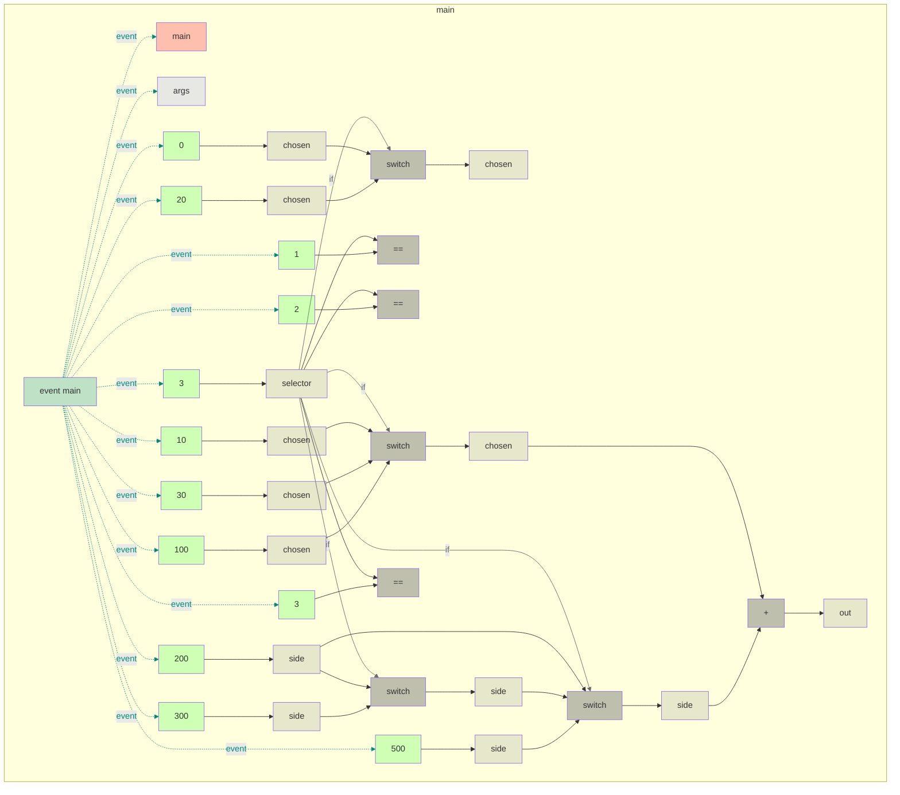

```mermaid
flowchart TD
  subgraph b0["main"]
    n1[event main]:::EVENT
    n2[main]:::RETURN
    n3[args]:::FUNC_PARAM
    n4[3]:::LITERAL
    n5[selector]:::VARIABLE
    n6[0]:::LITERAL
    n7[chosen]:::VARIABLE
    n8[200]:::LITERAL
    n9[side]:::VARIABLE
    n10[1]:::LITERAL
    n11[==]:::BIN_OP
    n12[10]:::LITERAL
    n13[chosen]:::VARIABLE
    n14[2]:::LITERAL
    n15[==]:::BIN_OP
    n16[20]:::LITERAL
    n17[chosen]:::VARIABLE
    n18[300]:::LITERAL
    n19[side]:::VARIABLE
    n20[switch]:::BIN_OP
    n21[chosen]:::VARIABLE
    n22[switch]:::BIN_OP
    n23[side]:::VARIABLE
    n24[3]:::LITERAL
    n25[==]:::BIN_OP
    n26[30]:::LITERAL
    n27[chosen]:::VARIABLE
    n28[100]:::LITERAL
    n29[chosen]:::VARIABLE
    n30[500]:::LITERAL
    n31[side]:::VARIABLE
    n32[switch]:::BIN_OP
    n33[chosen]:::VARIABLE
    n34[switch]:::BIN_OP
    n35[side]:::VARIABLE
    n36[+]:::BIN_OP
    n37[out]:::VARIABLE
    n1[event main]:::EVENT -. event .-> n2[main]:::RETURN
    n1[event main]:::EVENT -. event .-> n3[args]:::FUNC_PARAM
    n1[event main]:::EVENT -. event .-> n4[3]:::LITERAL
    n1[event main]:::EVENT -. event .-> n6[0]:::LITERAL
    n1[event main]:::EVENT -. event .-> n8[200]:::LITERAL
    n1[event main]:::EVENT -. event .-> n10[1]:::LITERAL
    n1[event main]:::EVENT -. event .-> n12[10]:::LITERAL
    n1[event main]:::EVENT -. event .-> n14[2]:::LITERAL
    n1[event main]:::EVENT -. event .-> n16[20]:::LITERAL
    n1[event main]:::EVENT -. event .-> n18[300]:::LITERAL
    n1[event main]:::EVENT -. event .-> n24[3]:::LITERAL
    n1[event main]:::EVENT -. event .-> n26[30]:::LITERAL
    n1[event main]:::EVENT -. event .-> n28[100]:::LITERAL
    n1[event main]:::EVENT -. event .-> n30[500]:::LITERAL
    n4[3]:::LITERAL --> n5[selector]:::VARIABLE
    n5[selector]:::VARIABLE --> n11[==]:::BIN_OP
    n5[selector]:::VARIABLE --> n15[==]:::BIN_OP
    n5[selector]:::VARIABLE -->|if| n20[switch]:::BIN_OP
    n5[selector]:::VARIABLE -->|if| n22[switch]:::BIN_OP
    n5[selector]:::VARIABLE --> n25[==]:::BIN_OP
    n5[selector]:::VARIABLE -->|if| n32[switch]:::BIN_OP
    n5[selector]:::VARIABLE -->|if| n34[switch]:::BIN_OP
    n6[0]:::LITERAL --> n7[chosen]:::VARIABLE
    n7[chosen]:::VARIABLE --> n20[switch]:::BIN_OP
    n8[200]:::LITERAL --> n9[side]:::VARIABLE
    n9[side]:::VARIABLE --> n22[switch]:::BIN_OP
    n9[side]:::VARIABLE --> n34[switch]:::BIN_OP
    n10[1]:::LITERAL --> n11[==]:::BIN_OP
    n12[10]:::LITERAL --> n13[chosen]:::VARIABLE
    n13[chosen]:::VARIABLE --> n32[switch]:::BIN_OP
    n14[2]:::LITERAL --> n15[==]:::BIN_OP
    n16[20]:::LITERAL --> n17[chosen]:::VARIABLE
    n17[chosen]:::VARIABLE --> n20[switch]:::BIN_OP
    n18[300]:::LITERAL --> n19[side]:::VARIABLE
    n19[side]:::VARIABLE --> n22[switch]:::BIN_OP
    n20[switch]:::BIN_OP --> n21[chosen]:::VARIABLE
    n22[switch]:::BIN_OP --> n23[side]:::VARIABLE
    n23[side]:::VARIABLE --> n34[switch]:::BIN_OP
    n24[3]:::LITERAL --> n25[==]:::BIN_OP
    n26[30]:::LITERAL --> n27[chosen]:::VARIABLE
    n27[chosen]:::VARIABLE --> n32[switch]:::BIN_OP
    n28[100]:::LITERAL --> n29[chosen]:::VARIABLE
    n29[chosen]:::VARIABLE --> n32[switch]:::BIN_OP
    n30[500]:::LITERAL --> n31[side]:::VARIABLE
    n31[side]:::VARIABLE --> n34[switch]:::BIN_OP
    n32[switch]:::BIN_OP --> n33[chosen]:::VARIABLE
    n33[chosen]:::VARIABLE --> n36[+]:::BIN_OP
    n34[switch]:::BIN_OP --> n35[side]:::VARIABLE
    n35[side]:::VARIABLE --> n36[+]:::BIN_OP
    n36[+]:::BIN_OP --> n37[out]:::VARIABLE
  end
  linkStyle 0 stroke:#00897b,color:#00897b
  linkStyle 1 stroke:#00897b,color:#00897b
  linkStyle 2 stroke:#00897b,color:#00897b
  linkStyle 3 stroke:#00897b,color:#00897b
  linkStyle 4 stroke:#00897b,color:#00897b
  linkStyle 5 stroke:#00897b,color:#00897b
  linkStyle 6 stroke:#00897b,color:#00897b
  linkStyle 7 stroke:#00897b,color:#00897b
  linkStyle 8 stroke:#00897b,color:#00897b
  linkStyle 9 stroke:#00897b,color:#00897b
  linkStyle 10 stroke:#00897b,color:#00897b
  linkStyle 11 stroke:#00897b,color:#00897b
  linkStyle 12 stroke:#00897b,color:#00897b
  linkStyle 13 stroke:#00897b,color:#00897b
  linkStyle 17 stroke:#6a6a6a,color:#6a6a6a
  linkStyle 18 stroke:#6a6a6a,color:#6a6a6a
  linkStyle 20 stroke:#6a6a6a,color:#6a6a6a
  linkStyle 21 stroke:#6a6a6a,color:#6a6a6a
  classDef LITERAL fill:#00FF0030
  classDef VARIABLE fill:#80808030
  classDef BIN_OP fill:#80808080
  classDef FUNC_PARAM fill:#8080FF30
  classDef RETURN fill:#FF808080
  classDef EXTERNAL fill:#FFA50040
  classDef UNMODELLED fill:#FF000030,stroke-dasharray: 4 2
  classDef EVENT fill:#00897B40
```
