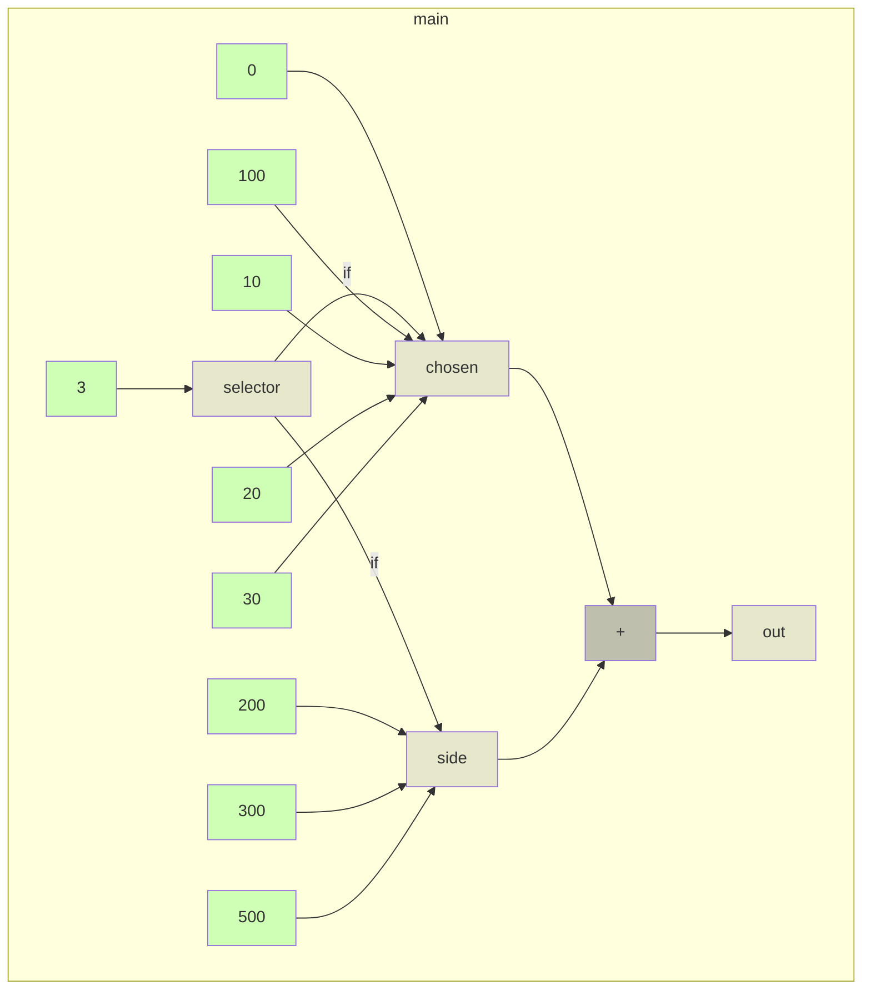

# switchStatement: spike value graph (condensed)

```mermaid
flowchart TD
  subgraph m0["main"]
    n0["+"]:::BIN_OP
    n1["0"]:::LITERAL
    n2["100"]:::LITERAL
    n3["10"]:::LITERAL
    n4["200"]:::LITERAL
    n5["20"]:::LITERAL
    n6["300"]:::LITERAL
    n7["30"]:::LITERAL
    n8["3"]:::LITERAL
    n9["500"]:::LITERAL
    n10["chosen"]:::VARIABLE
    n11["out"]:::VARIABLE
    n12["selector"]:::VARIABLE
    n13["side"]:::VARIABLE
  end
  n0 --> n11
  n1 --> n10
  n10 --> n0
  n12 -->|if| n10
  n12 -->|if| n13
  n13 --> n0
  n2 --> n10
  n3 --> n10
  n4 --> n13
  n5 --> n10
  n6 --> n13
  n7 --> n10
  n8 --> n12
  n9 --> n13
  classDef LITERAL fill:#00FF0030
  classDef VARIABLE fill:#80808030
  classDef BIN_OP fill:#80808080
  classDef FUNC_PARAM fill:#8080FF30
  classDef RETURN fill:#FF808080
  classDef EXTERNAL fill:#FFA50040
  classDef UNMODELLED fill:#FF000030,stroke-dasharray: 4 2
```
